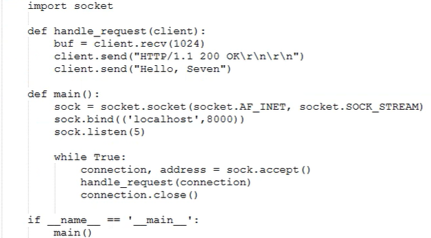

# Flask框架01

## 1.基础铺垫

### 1-1  装饰器知识扩展

```python
# 回顾正常的装饰器样式
def wrapper(func):
    def inner(*args, **kwargs):
        return func(*args, **kwargs)
    return inner
@wrapper
def index(request):
    pass
```

```python
# 带参装饰器
def wrapper(option):
    def inner(func, *args, **kwargs):
        return func(*args, **kwargs)
    return inner
@wrapper({'k1': 'v1'})
def index(request):
    pass
```

```markdown
# 分析
当装饰器带参数时
首先：wrapper({'k1': 'v1'})会开始执行 -->返回inner
然后：@wrapper(..) ==> @inner
我们知道装饰器在装饰函数时候会将函数名当作参数传进装饰器,并执行，所以：
@inner --> inner(index)

让我们总结一下：
带参装饰器，只要当前py文件一执行，
就会立即执行wrapper({'k1': 'v1'})
然后立即执行inner(index)
```

```python
# 变形
url_map = {
    '/index': index
}
def route(option):
    def inner(func, *args, **kwargs):
        url_map[option['path']] = func
    return inner
@route({'path': '/index'})
def index(request):
    pass
```

---

### 1-2 session & cookie 原理(自行回顾)

### 1-3 类的继承 一个知识点

```python
class MyDict(dict):
	def __init__(self, *args, **kwargs):
        super(MyDict, self).__init__(*args, **kwargs)
        self.modify = True
obj = MyDict()
那么obj就会自带modify=True的属性
意思就是比如：字典可以被继承，然后我们在这个类上面在开发我们需要的功能     
```

## 2.三大框架的介绍

```
Django：大而全的web框架，内部包含非常多的组件：ORM、Form、ModelForm、缓存、Session、中间件、信号等
```

```
Flask：短小精悍，内部没有太多组件。第三方组件非常丰富，可定制性非常强。类似简单的任务应用，会比较简洁。
```

```
Tornado：异步非阻塞框架(node.js)
```

## 3.Flask框架基础

### 3-1 安装与本质

首先说说flask

```
Flask是一个基于python开发并且依赖jinjia2模版与Werzeug WSGI服务的一个微型框架，而Werkzeug的本质就是socket服务端，用于接收http请求并对请求进行预处理，然后出发Flask框架，开发人员基于Flask框架提供的功能对请求进行处理，然后将渲染后的记过返回给浏览器
```

a.安装

```
pip3 install flask
```

b.`wsgi，werkzeug完成socket功能`

**`werkzeug`示例：**

```python
from werkzeug.wrappers import Request, Reponse
@Request.application
def hell(request):
    return Reponse('Hello World')
if __name__ == '__main__':
    from werkzeug.serving import runsimple
    runsimple('localhost', 4000, hello)  # 监听端口，请求一来就执行hello函数    
```

**`wsgiref`示例：**

```python
from wsgiref.simple_server import make_server
def runserver(environ, start_response):
	start_response('200 OK', [('Content-Type', 'text/html')])
    return [bytes('<h1>Hello Web !</h1>', encoding='utf-8'), ]
if __name__ == '__main__':
    httpd = make_server('', 8000, runserver)
    httpd.server_forever()
```

本质的本质就是`socket`



### 3-2 使用`

#### 3-2-1 基本使用

```python
from flask import Flask
app = Flask(__name__)

@app.route('/')
def hello_world():
    return 'Hello World'

if __name__ == '__main__':
    app.run()

```

#### 3-2-2 配置文件

```
flask中的配置文件是一个flask.config.Config对象（继承字典）,默认配置为：
    {
        'DEBUG':                                get_debug_flag(default=False),  是否开启Debug模式
        'TESTING':                              False,                          是否开启测试模式
        'PROPAGATE_EXCEPTIONS':                 None,                          
        'PRESERVE_CONTEXT_ON_EXCEPTION':        None,
        'SECRET_KEY':                           None,
        'PERMANENT_SESSION_LIFETIME':           timedelta(days=31),
        'USE_X_SENDFILE':                       False,
        'LOGGER_NAME':                          None,
        'LOGGER_HANDLER_POLICY':               'always',
        'SERVER_NAME':                          None,
        'APPLICATION_ROOT':                     None,
        'SESSION_COOKIE_NAME':                  'session',
        'SESSION_COOKIE_DOMAIN':                None,
        'SESSION_COOKIE_PATH':                  None,
        'SESSION_COOKIE_HTTPONLY':              True,
        'SESSION_COOKIE_SECURE':                False,
        'SESSION_REFRESH_EACH_REQUEST':         True,
        'MAX_CONTENT_LENGTH':                   None,
        'SEND_FILE_MAX_AGE_DEFAULT':            timedelta(hours=12),
        'TRAP_BAD_REQUEST_ERRORS':              False,
        'TRAP_HTTP_EXCEPTIONS':                 False,
        'EXPLAIN_TEMPLATE_LOADING':             False,
        'PREFERRED_URL_SCHEME':                 'http',
        'JSON_AS_ASCII':                        True,
        'JSON_SORT_KEYS':                       True,
        'JSONIFY_PRETTYPRINT_REGULAR':          True,
        'JSONIFY_MIMETYPE':                     'application/json',
        'TEMPLATES_AUTO_RELOAD':                None,
    }
 
方式一：
    app.config['DEBUG'] = True
 
    PS： 由于Config对象本质上是字典，所以还可以使用app.config.update(...)
 
方式二：
    app.config.from_pyfile("python文件名称")
        如：
            settings.py
                DEBUG = True
 
            app.config.from_pyfile("settings.py")
 
    app.config.from_envvar("环境变量名称")
        环境变量的值为python文件名称名称，内部调用from_pyfile方法
 
 
    app.config.from_json("json文件名称")
        JSON文件名称，必须是json格式，因为内部会执行json.loads
 
    app.config.from_mapping({'DEBUG':True})
        字典格式
 
    app.config.from_object("python类或类的路径")
 
        app.config.from_object('pro_flask.settings.TestingConfig')
 
        settings.py
 
            class Config(object):
                DEBUG = False
                TESTING = False
                DATABASE_URI = 'sqlite://:memory:'
 
            class ProductionConfig(Config):
                DATABASE_URI = 'mysql://user@localhost/foo'
 
            class DevelopmentConfig(Config):
                DEBUG = True
 
            class TestingConfig(Config):
                TESTING = True
 
        PS: 从sys.path中已经存在路径开始写
     
 
    PS: settings.py文件默认路径要放在程序root_path目录，如果instance_relative_config为True，则就是instance_path目录
```

#### 3-2-3 路由系统

```
@app.route('/user/<username>')
@app.route('/post/<int:post_id>')
@app.route('/post/<float:post_id>')
@app.route('/post/<path:path>')
@app.route('/login', methods=['GET', 'POST'])
```

常用路由系统有以上五种，所有的路由系统都是基于一下对应关系来处理：

```
DEFAULT_CONVERTERS = {
    'default':          UnicodeConverter,
    'string':           UnicodeConverter,
    'any':              AnyConverter,
    'path':             PathConverter,
    'int':              IntegerConverter,
    'float':            FloatConverter,
    'uuid':             UUIDConverter,
}
```

注册路由原理

```
...待补充
```

自定制正则路由匹配

```
...待补充
```

#### 3-2-4 模版

1、模板的使用

Flask使用的是Jinja2模板，所以其语法和Django无差别

后端dict在前端可以使用句点符、[]、get（）三种方式取值

dict遍历需要加()

```
<tbody>
    
    <tr>
        <td>{{ id }}</td>
        <td>{{ user.name }}</td>
        <td>{{ user['gender'] }}</td>
        <td>{{ user.get('age') }}</td>
        <td><a href="/detail/{{ id }}">用户信息</a></td>
    </tr>
    
</tbody>
```

2、自定义模板方法

```
...待补充
```

#### 3-2-5 请求和响应

```
from flask import Flask
from flask import request
from flask import render_template
from flask import redirect
from flask import make_response
app = Flask(__name__)

@app.route('/login.html', methods=['GET', "POST"])
def login():

# 请求相关信息
# request.method
# request.args
# request.form
# request.values
# request.cookies
# request.headers
# request.path
# request.full_path
# request.script_root
# request.url
# request.base_url
# request.url_root
# request.host_url
# request.host
# request.files
# obj = request.files['the_file_name']
# obj.save('/var/www/uploads/' + secure_filename(f.filename))

# 响应相关信息
# return "字符串"
# return render_template('html模板路径',**{})
# return redirect('/index.html')

# response = make_response(render_template('index.html'))
# response是flask.wrappers.Response类型
# response.delete_cookie('key')
# response.set_cookie('key', 'value')
# response.headers['X-Something'] = 'A value'
# return response

return "内容"

if __name__ == '__main__':
	app.run()
```

#### 3-2-6 Session

session 对象允许你在不同请求间存储特定用户的信息。它是在 Cookies 的基础上实现的，并且对 Cookies 进行密钥签名要使用会话，你需要设置一个密钥。

```
设置：session['username'] ＝ 'xxx'
删除：session.pop('username', None)
```

```
from flask import Flask, session, redirect, url_for, escape, request
 
app = Flask(__name__)
 
@app.route('/')
def index():
    if 'username' in session:
        return 'Logged in as %s' % escape(session['username'])
    return 'You are not logged in'
 
@app.route('/login', methods=['GET', 'POST'])
def login():
    if request.method == 'POST':
        session['username'] = request.form['username']
        return redirect(url_for('index'))
    return '''
        <form action="" method="post">
            <p><input type=text name=username>
            <p><input type=submit value=Login>
        </form>
    '''
 
@app.route('/logout')
def logout():
    # remove the username from the session if it's there
    session.pop('username', None)
    return redirect(url_for('index'))
 
# set the secret key.  keep this really secret:
app.secret_key = 'A0Zr98j/3yX R~XHH!jmN]LWX/,?RT'

基本使用
```

