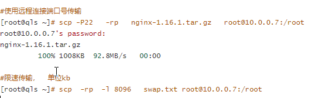
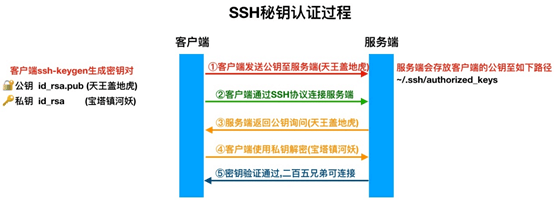

### Linux定时任务

#### crond

```
系统级别				定时文件清理，日志切割，定时手机系统状态信息
用户级别				同步系统时间，定时备份数据

定时任务相关文件
[root@VM_0_16_centos ~]# ll /etc/cron* -d
drwxr-xr-x. 2 root root 4096 Aug 20 19:34 /etc/cron.d		
drwxr-xr-x. 2 root root 4096 Mar  7 14:39 /etc/cron.daily	系统每天执行定时
-rw-------  1 root root    0 Nov 20  2018 /etc/cron.deny	黑名单
drwxr-xr-x. 2 root root 4096 Jul  2 15:03 /etc/cron.hourly	系统每小时
drwxr-xr-x. 2 root root 4096 Jun 10  2014 /etc/cron.monthly	系统每分钟
-rw-r--r--. 1 root root  181 Aug 21 08:48 /etc/crontab		定时任务的主配置文件
drwxr-xr-x. 2 root root 4096 Jun 10  2014 /etc/cron.weekly	系统每周

[root@sgt ~]# cat /etc/crontab
SHELL=/bin/bash							# 定时任务的命令解释器
PATH=/sbin:/bin:/usr/sbin:/usr/bin		# 命令的环境变量
MAILTO=root								# 接收邮件的用户
# For details see man 4 crontabs
# Example of job definition:
# .---------------- minute (0 - 59)
# |  .------------- hour (0 - 23)
# |  |  .---------- day of month (1 - 31)
# |  |  |  .------- month (1 - 12) OR jan,feb,mar,apr ...
# |  |  |  |  .---- day of week (0 - 6) (Sunday=0 or 7) OR sun,mon,tue,wed,thu,fri,sat
# |  |  |  |  |
# *  *  *  *  * user-name  command to be executed

*		所有，每
-		连续的时间，1-5
，		不连续的时间1,5
*/5		每5个单位
时间示例
 00 02 * * *		每天的凌晨2点整执行
 00 02 1 * *		每个月1号的凌晨2点执行
 00 02 14 2 *
 00 02 * * 7
 00 02 * 6 5
 00 02 14 * 7
 00 02 14 2 7
 */10 02 * * *
 * * * * *			每分钟执行一次
 00 00 14 2 *		每年的2越14日凌晨12点执行一次
 00 02 1-8 * *		每个月的1号到8号凌晨2点整执行一次
 45 4 1,10,22 * *
 45 4 1-10 * *
 3,15 8-11 */2 * *
 0 23-7/2 * * *
 15 21 * * 1-5
```

```
crontab				定时任务命令
选项
	-e				编辑定时任务 vim /var/spool/cron/root
	-l				查看定时任务 cat ...
	-r				删除定时任务文件
	-u				指定用户，默认是当前用户	
```

##### 每分钟执行同步执行任务

安装，使用该命令同步时间

```bash 
yum install  ntpdate  -y
date
Wed Aug 21 09:17:32 CST 2019
ntpdate ntp.aliyun.com				# 同步系统时间

# 可以设置一下时间，然后在同步，进行测试
date -s 2019/08/01
ntpdate ntp.aliyun.com
date

crontab -e		# 执行定时任务命令
# 编写：
* * * * * ntpdate ntp.aliyun.com

# 使用tailf /var/log/cron查看是否有日志记录(是否执行成功)
# 同时检查是否生效，查看报错信息：
[root@sgt ~]# tailf  /var/mail/root
X-Cron-Env: <SHELL=/bin/sh>
X-Cron-Env: <HOME=/root>
X-Cron-Env: <PATH=/usr/bin:/bin>
X-Cron-Env: <LOGNAME=root>
X-Cron-Env: <USER=root>
Message-Id: <20190731160301.85B1920080AF@sgt.localdomain>
Date: Thu,  1 Aug 2019 00:03:01 +0800 (CST)

/bin/sh: ntpdate: command not found

# 重新编写定时任务
[root@sgt ~]# crontab -e
# time synchronous
* * * * * /usr/sbin/ntpdate ntp.aliyun.com
esc ： wq
# 然后查看时间修改没
date
Wed Aug 21 09:45:07 CST 2019
You have new mail in /var/spool/mail/root

# 停掉邮件服务
systemctl stop postfix
# 发现系统生成大量小文件
ll /var/spool/postfix/maildrop/
# 再次修改定时任务
[root@sgt ~]# crontab -e
# time synchronous
* * * * * /usr/sbin/ntpdate ntp.aliyun.com &>/dev/null

# 发现系统不再生成小文件
ll /var/spool/postfix/maildrop/
# 启动右键服务
systemctl start postfix

# 邮件不会再次发送了
ll /var/mail/root
```

#### 定时向一个文件追加时间信息

```bash
[root@sgt ~]# crontab -e
# time synchronous
* * * * * /usr/sbin/ntpdate ntp.aliyun.com &>/dev/null
# add time into time.txt
* * * * * /usr/bin/date +\%F_\%T >> /root/time.txt

# 注意，定时任务命令中的特殊符号，比如%需要进行转义，否则无法识别
# 查看是否成功
[root@sgt ~]# cat /root/time.txt 
2019-08-21_10:08:02
2019-08-21_10:09:01
```

#### 定时备份数据

```bash
# 要求
# 备份/etc/ /var/
# 名字 etc_2019_08_21_10_09.tar.gz
# 统一存放一个备份目录
# 删除三天前的备份数据

[root@sgt ~]# vim back.sh
#!bin/bash
Time=$(date +%F_%H-%M)
mkdir -p /backup
cd /
tar czPf /backup/etc_${Time}.tar.gz etc/
find /backup -type f -mtime +3 -delete

# 脚本中会出现命令找不到的情况
# 先查看环境变量参数
[root@sgt ~]# echo $PATH
/usr/local/sbin:/usr/local/bin:/usr/sbin:/usr/bin:/root/bin
# 再在脚本中添加环境变量
#!bin/bash
export PATH=/usr/local/sbin:/usr/local/bin:/usr/sbin:/usr/bin:/root/bin
Time=$(date +%F_%H-%M)
mkdir -p /backup
cd /
tar czPf /backup/etc_${Time}.tar.gz etc/
find /backup -type f -mtime +3 -delete

# 再将备份脚本添加到定时任务中
[root@sgt ~]# crontab -e
# time synchronous
* * * * * /usr/sbin/ntpdate ntp.aliyun.com &>/dev/null
# add time into time.txt
* * * * * /usr/bin/date +\%F_\%T >> /root/time.txt  &>/dev/null
# backup etc file
* * * * * /bin/sh /root/back.sh  &>/dev/null
# 查看结果
[root@sgt ~]# ll /backup/
total 39904
-rw-r--r--. 1 root root 10214345 Aug 21 10:36 etc_2019-08-21_10-36.tar.gz
-rw-r--r--. 1 root root 10214345 Aug 21 10:37 etc_2019-08-21_10-37.tar.gz
-rw-r--r--. 1 root root 10214345 Aug 21 10:38 etc_2019-08-21_10-38.tar.gz
-rw-r--r--. 1 root root 10214345 Aug 21 10:39 etc_2019-08-21_10-39.tar.gz

# 测试删除命令可以这样
for i in {15..21} ;do date -s "2019/08/$i" && sh back.sh ;done
```

#### 定时任务怎么备份

```
/var/spool/cron/root  # 备份此文件即可，如果有脚本，需要把脚本也进行备份
```

#### 如何禁止一个用户使用定时任务

```
echo 'sgt' >>/etc/cron.deny			# 将用户名添加进黑名单文件
```

#### 练习题

```bash
1.每分钟打印你的名字到oldboy.txt中
# 注释
* * * * * command
2.每周六的早上8点到12点，执行/scripts/test.sh脚本
# 注释
00 8-12 * * 6 command
3.每个月的1号，执行/scripts/oldboy.sh脚本
# 注释
00 01 1 * * command
4.每年的10月份1号到7号，执行/scripts/holiday.sh脚本
# 注释
00 01 1-7 10 * command
5.每天的9点和11点，执行/scripts/test.sh脚本
# 注释
00 9,11 * * * command
```

#### 定时给小姐姐发情书

安装邮件软件

```
yum  install -y  mailx
```

配置

```
set from=514464944@qq.com
set smtp=smtp.qq.com
set smtp-auth-user=514464944@qq.com
set smtp-auth-password=cthwdglbjltcbhfj
set smtp-auth=login
set smtp=smtps://smtp.qq.com:465
set ssl-verify=ignore
set nss-config-dir=/etc/pki/nssdb/
```

修改配置

```
vim /etc/mail.rc
```

发送邮件

```
echo  "123"  |mail  -s  'hello'   1XXXX@qq.com
```

使用脚本定时执行


#### 进程管理

```
[root@sgt /etc]# ps aux   # 他是静态显示
USER        PID %CPU %MEM    VSZ   RSS TTY      STAT START   TIME COMMAND
第一列：USER		进程运行的用户
第二列：PID			进程pid号
第三列：%CPU		占用CPU的百分比
第四列：%MEM		占用内存的百分比
第五列：VSZ			占用虚拟内存
第六咧：RSS			占用的物理内存
第七列：TTY			终端 ？代表内核
第八列：STAT		状态	S休眠 R正在运行 Ss+在前台运行
第九列：START		进程启动时间
第十列：TIME		进程占用CPU的时间
第十一列：COMMAND 	执行的命令 -bash代表闲置状态

[root@sgt /etc]# top
top - 11:49:01 up  2:52,  1 user,  load average: 0.00, 0.01, 0.05
Tasks: 101 total,   1 running,  92 sleeping,   8 stopped,   0 zombie
%Cpu(s):  0.0 us,  0.3 sy,  0.0 ni, 99.7 id,  0.0 wa,  0.0 hi,  0.0 si,  0.0 st
KiB Mem :  2028088 total,   753404 free,   160328 used,  1114356 buff/cache
KiB Swap:  2097148 total,  2097148 free,        0 used.  1650016 avail Mem 

   PID USER      PR  NI    VIRT    RES    SHR S %CPU %MEM     TIME+ COMMAND     第一行：  11:49:01当前系统时间 2:52当前系统运行时间 1 user当前登录的用户数量
第二行：  Tasks: 101 total总任务的数量


关于进程的命令
ps 				查看进程
top				查看性能的命令
htop			查看性能的命令升级版
yum install htop -y

yum install  glances  -y
glances			显示系统性能

ss -lntp		查看端口号

yum install net_tools
netstat	-lntp	查看端口号，升级版

netstat -rn		查看网关路由
netstat -ant	查看tcp的11种状态

nmap -爬-100 10.0.0.100	扫描端口

关闭进程
kill 10466		根据pid号杀进程  -9强制杀 -1重载 如果进程不存在会提示No such process
killall vim		根据进程名去杀 如果进程不存在会提示No such process
pkill top		模糊杀进程，包含进程名的所有进程都会终止，没有任何提示
```

#### 后台管理

```
yum install screen
screen -S		给会话起个命令
screen -list	进入子窗口
ctrl a + d		临时退出 
screen -r  		
```

#### ssh

```
创建一个新的虚拟机，ip改成不一样的
sed  -i  's#100#99#g'  /etc/sysconfig/network-scripts/ifcfg-eth[01]
systemctl  restart  network

远程连接
数据加密传输

Telnet		不加密		tcp/23		不支持root用户登录
ssh			加密		tcp/22		支持root用户登录

测试使用Telnet
安装服务端
yum  install  -y  telnet-server
启动服务
systemctl  start telnet.socket
查看端口号
netstat -lntp | grep 23
```

#### ssh相关命令

```bash
scp			ssh远程传输的命令
ssh			远程登录的命令
ssh-keygen	生成密钥的命令
ssh-copy-id	分发公钥的命令
# 推
scp -rp a.txt root@10.0.0.100:/root	将文件推送到ip为10.0.0.100的服务器，用户是root
# 拉
scp -rp root@10.0.0.99:/root/b.txt /root/sgt 将ip为10.0.0.99的服务器的文件b.txt拉取到自己的root/sgt目录下
```



#### 密钥连接登录



```
生成密钥对
ssh-keygen -t rsa		
分发公钥
ssh-copy-id   -i  /root/.ssh/id_rsa.pub   root@10.0.0.99
连接测试
ssh root@10.0.0.99
```

#### **ssh优化**

```bash
Port 6666                       # 变更SSH服务远程连接端口
PermitRootLogin         no      # 禁止root用户直接远程登录
PasswordAuthentication  no      # 禁止使用密码直接远程登录
UseDNS                  no      # 禁止ssh进行dns反向解析，影响ssh连接效率参数
GSSAPIAuthentication    no      # 禁止GSS认证，减少连接时产生的延迟
```


