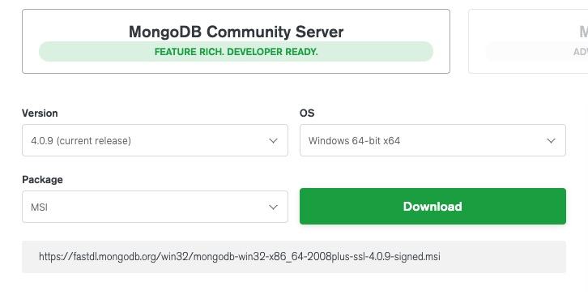

## Mongodb

### 介绍


```
.MongoDB 是由C++语言编写的，是一个基于分布式文件存储的开源数据库系统。
.MongoDB 旨在为WEB应用提供可扩展的高性能数据存储解决方案。
.MongoDB 将数据存储为一个文档，数据结构由键值(key=>value)对组成。MongoDB 文档类似于 JSON 对象。字段值可以包含其他文档，数组及文档数组。
.MongoDB 是一个介于关系数据库和非关系数据库之间的产品，是非关系数据库当中功能最丰富，最像关系数据库的。
```


**什么是NoSQL?**

```
.NoSQL，指的是非关系型的数据库。NoSQL有时也称作Not Only SQL的缩写，是对不同于传统的关系型数据库的数据库管理系统的统称。
.NoSQL用于超大规模数据的存储。（例如谷歌或Facebook每天为他们的用户收集万亿比特的数据）。这些类型的数据存储不需要固定的模式，无需多余操作就可以横向扩展。
```

### 安装(windows平台)

#### MongoDB 下载与程序安装

```
MongoDB 提供了可用于 32 位和 64 位系统的预编译二进制包，你可以从MongoDB官网下载安装，MongoDB 预编译二进制包下载地址：https://www.mongodb.com/download-center#community
```



```
MongoDB for Windows 64-bit 适合 64 位的 Windows Server 2008 R2, Windows 7 , 及最新版本的 Window 系统。
MongoDB for Windows 32-bit 适合 32 位的 Window 系统及最新的 Windows Vista。 32 位系统上 MongoDB 的数据库最大为 2GB。
MongoDB for Windows 64-bit Legacy 适合 64 位的 Windows Vista, Windows Server 2003, 及 Windows Server 2008 。
```

```
根据你的系统下载 32 位或 64 位的 .msi 文件，下载后双击该文件，按操作提示安装即可。
安装过程中，你可以通过点击 "Custom(自定义)" 按钮来设置你的安装目录。
下一步安装 **"install mongoDB compass"** 不勾选，否则可能要很长时间都一直在执行安装，MongoDB Compass 是一个图形界面管理工具，我们可以在后面自己到官网下载安装，下载地址：https://www.mongodb.com/download-center/compass。
```


```
安装的最后如果出错点击忽略，然后进入安装目录bin下(我的是D:\programming\MongoDB\bin)，找到mongod.cfg文件用notepad++打开，删除最后一行mp的字符串，保存就能解决了。
```

```
将mongodb加入环境变量(D:\programming\MongoDB\bin)
```

#### 启动、关闭MongoDB服务

```
net start MongoDB
net stop MongoDB
当然程序安装完成，默认是服务被启动的，查看服务可以用windows系统自带服务组件汇总查看
```

### 数据库操作

```
show dbs 查看数据库
user db_name 切换数据库
db.dropDatabase() 删除数据库(需切换到待删数据库)
db.table1.insert({'a':1}) 创建数据库，自动会切换到数据库插入数据
```

### 表操作

```
使用前先切换数据库
show tables 查看所有表
db.table1.insert({'b':2}) 增加表(表不存在就创建)
db.table1.drop() 删表
```

### 表记录操作

```
db.test.insert(user0) 插入一条
db.user.insertMany([user1,user2,user3,user4,user5]) 插入多条
db.table.insertMany([{"name":"mac"},{"salary":"123456"}]) 插入多条
db.table.insert({"name":"shj","salary":30000,"hobby":"fasao"}) 插入一条

db.user.find({'name':'alex'}) 查name=alex的记录
db.user.find({'name':{"$ne":'alex'}}) $ne代表！=，查name!=alex的记录
db.table.find({"hobby":{"$ne":"fasao"}})
db.user.find({'_id':{"$gt":2}}) $gt代表>，查id>2的记录
db.table.find({"salary":{"$gt":20000}})
db.user.find({'_id':{"$gte":2}}) $gte代表>=，查id>=2的记录
db.user.find({'_id':{"$lt":2}}) $lt代表<，查id<2的记录
db.user.find({'_id':{"$lte":2}}) $lte代表<=，查id<=2的记录

db.user.update({'_id':2},{"$set":{"name":"xxxx"}}) 改数据
db.table.update({"salary":null},{"$set":{"salary":66666}})
db.table.update({"salary":123456},{"$set":{"name":"fxx","hobby":"study"}})

db.user.deleteOne({'age':8}) 删除匹配到的第一个
db.user.deleteMany({'addr.contry':'China'}) 删全部匹配
db.user.deleteMany({}) 删除所有
```

### pymongo

```
安装
pip3 install pymongo
python中导入
import pymongo
host = '127.0.0.1'
port = 27017
username = 'root'
password = '123'
连接数据库
conn = pymongo.MongoClient(host=host, port=port, username=username, password=password)
切换数据库
db = conn["db_name"]
table = db['表名']
查数据
table.find({"salary":{"$gte":100}})
插数据
table.insert({'k1':'v1'}) 
table.insert([{'k1':'v1'}, {'k2':'v2'}, {'k3':'v3'}]) 默认支持插多个
db.sgt.insert([{'name': 'fxx', 'gender': 'male', 'salary': 100000},
               {'name': 'lzp', 'gender': 'male', 'salary': 80000},
               {'name': 'shj', 'gender': 'female', 'salary': 90000}])
删数据
table.remove({})
db.sgt.remove({'name': 'fxx') 删除所以name=fxx的记录
db.sgt.delete_one({'name': 'shj'}) 删除name=shj的第一条记录
db.sgt.delete_many({'name': 'xxx'}) 删除所以name=xxx的记录
改数据
table.update({"_id":2},{"$set":{"name":"xxx"}})
db.sgt.update({'name': 'sgt'}, {'$set': {'salary': 60000}}) 给该条记录添加新字段
```

