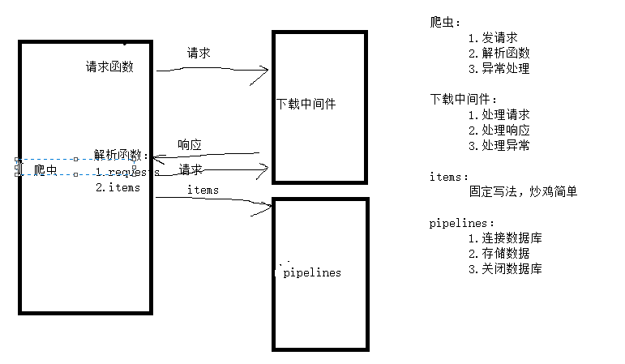

## Scrapy 爬虫框架

### Scrapy介绍

Scrapy是一个为了爬取网站数据，提取结构性数据而编写的应用框架，通过实现少量的代码，就能够快速的抓取

基于twisted框架开发而来，Twisted[`twistid]是一个事件驱动的python网络框架，异步非阻塞实现并发，可以加快下载速度


1. **引擎(EGINE)**

   引擎负责控制系统所有组件之间的数据流，并在某些动作发生时触发事件。有关详细信息，请参见上面的数据流部分。

2. **调度器(SCHEDULER)**
   用来接受引擎发过来的请求, 压入队列中, 并在引擎再次请求的时候返回. 可以想像成一个URL的优先级队列, 由它来决定下一个要抓取的网址是什么, 同时去除重复的网址

3. **下载器(DOWLOADER)**
   用于下载网页内容, 并将网页内容返回给EGINE，下载器是建立在twisted这个高效的异步模型上的

4. **爬虫(SPIDERS)**
   SPIDERS是开发人员自定义的类，用来解析responses，并且提取items，或者发送新的请求

5. **项目管道(ITEM PIPLINES)**
   在items被提取后负责处理它们，主要包括清理、验证、持久化（比如存到数据库）等操作

6. **下载器中间件(Downloader Middlewares)**

   位于Scrapy引擎和下载器之间，主要用来处理从EGINE传到DOWLOADER的请求request，已经从DOWNLOADER传到EGINE的响应response，你可用该中间件做以下几件事

   ```
   1. process a request just before it is sent to the Downloader (i.e. right before Scrapy sends the request to the website);
   2. change received response before passing it to a spider;
   3. send a new Request instead of passing received response to a spider;
   4. pass response to a spider without fetching a web page;
   5. silently drop some requests.
   ```

7. **爬虫中间件(Spider Middlewares)**
   位于EGINE和SPIDERS之间，主要工作是处理SPIDERS的输入（即responses）和输出（即requests）

### 安装

**Windows平台**

```
1、pip3 install wheel 
    #安装后，便支持通过wheel文件安装软件，wheel文件官网：
    https://www.lfd.uci.edu/~gohlke/pythonlibs
3、pip3 install lxml
4、pip3 install pyopenssl
5、下载并安装pywin32：https://sourceforge.net/projects/pywin32/files/pywin32/
	直接安装 pip3 install pywin32
6、下载twisted的wheel文件：http://www.lfd.uci.edu/~gohlke/pythonlibs/#twisted
	进入网站后，选择对应的python版本的whl文件进行下载，
    Twisted‑19.7.0‑cp36‑cp36m‑win_amd64.whl
7、在下载的目录执行pip3 install Twisted‑19.7.0‑cp36‑cp36m‑win_amd64.whl
8、pip3 install scrapy    
```

**Linux平台**

```
pip3 install scrapy
```

### 命令行工具()

```
1 查看帮助
    scrapy -h
    scrapy <command> -h

2 有两种命令：其中Project-only必须切到项目文件夹下才能执行，而Global的命令则不需要
执行全局命令：请确保不在某个项目的目录下，排除受该项目配置的影响
Global commands:
	创建项目 scrapy startproject ProjectName 
		    cd ProjectName
    创建爬虫程序 scrapy genspider baidu www.baidu.com
    如果是在项目目录下，则得到的是该项目的配置 scrapy settings --get XXX
    运行一个独立的python文件，不必创建项目 scrapy runspider baidu.py
    scrapy shell https://www.baidu.com
    	response
        response.status
        response.body
        view(response)
	如果页面显示内容不全，不全的内容则是ajax请求实现的，以此快速定位问题 scrapy view https://www.taobao.com
    独立于程单纯地爬取一个页面，可以拿到请求头 scrapy fetch --nolog --headers https://www.taobao.com
    scrapy的版本 scrapy version
    依赖库的版本 scrapy version -v
    
执行项目命令：切到项目目录下
Project-only commands:
    scrapy crawl baidu  运行爬虫，必须创建项目才行
    					baidu为爬虫py文件中的name值(不是文件名)
    					确保配置文件中ROBOTSTXT_OBEY = False
    scrapy check        检测项目中有无语法错误
    scrapy list         列出项目中所包含的爬虫名
    scrapy edit         编辑器，一般不用
    scrapy parse        scrapy parse url地址
    scrapy callback     回调函数  #以此可以验证我们的回调函数是否正确
    scrapy bench        scrapy bentch压力测试

3 官网链接
    https://docs.scrapy.org/en/latest/topics/commands.html
```

### scrapy项目文件结构

在windows下创建一个scrapy项目的文件夹，用于存放项目文件，比如在`D:\python_project\my_scrapy`，然后cmd命令进入该路径开始创建一个scrapy项目

`scrapy startproject demo0` =>`cd demo0` =>`scrapy genspider pp01 tmall.com`

创建爬虫项目 => 进入项目文件目录下 => 在项目下创建爬虫,`pp01`是文件名，`tmall.com`是爬取的初始`url`，回车之后会发现，`demo`项目的`spiders`文件夹下会多出一个`pp01.py`文件

**pp01.py**

```python
# -*- coding: utf-8 -*-
import scrapy


class Pp01Spider(scrapy.Spider):
    name = 'pp01'
    allowed_domains = ['tmall.com']
    start_urls = ['http://tmall.com/']

    def parse(self, response):
        pass
```

```
project_name/ 
    |__ scrapy.cfg 项目的主配置信息，部署scrapy，爬虫相关的配置信息在settings.py中
    |__ project_name/
        |__ __init__.py
        |__ items.py 设置数据存储模板，用于结构化数据，如：Django的Model
        |__ pipelines.py 数据处理行为，如：一般结构化的数据持久化
        |__ settings.py 配置文件，如：递归的层数、并发数，延迟下载等。
        |__     强调:配置文件的选项必须大写否则无效，正确写法USER_AGENT='xxxx'
        |__ spiders/ 爬虫目录，如：创建文件，编写爬虫规则
        |__ __init__.py
        |__ Pa1.py 一般创建爬虫文件时，以网站域名命名
        |__ Pa2.py
        |__ Pa3.py
```

**tips:**在`settings.py`文件中修改`ROBOTSTXT_OBEY = False`



```
在项目目录下新建：run.py
from scrapy.cmdline import execute
execute(['scrapy', 'crawl', 'xiaohua']
```

```
import sys,os
sys.stdout=io.TextIOWrapper(sys.stdout.buffer,encoding='gb18030')
```

### Spiders

```
.Spiders是由一系列类(定义了一个网址或一组网址将被爬取)组成，具体包括如何执行爬取任务并且如何从页面中提取结构化数据
.通过请求函数、解析函数等方法去爬取和解析页面的地方
```

#### Spiders会循环做如下事情

```
1、生成初始的Requests来爬取第一个URLS，并且标识一个回调函数
第一个请求定义在start_requests()方法内默认从start_urls列表中获得url地址来生成Request请求，默认的回调函数是parse方法。回调函数在下载完成返回response时自动触发

2、在回调函数中，解析response并且返回值
返回值可以4种：
        包含解析数据的字典
        Item对象
        新的Request对象（新的Requests也需要指定一个回调函数）
        或者是可迭代对象（包含Items或Request）

3、在回调函数中解析页面内容
通常使用Scrapy自带的Selectors，但很明显你也可以使用Beutifulsoup，lxml或其他你爱用啥用啥。

4、最后，针对返回的Items对象将会被持久化到数据库
通过Item Pipeline组件存到数据库：https://docs.scrapy.org/en/latest/topics/item-pipeline.html#topics-item-pipeline）
或者导出到不同的文件（通过Feed exports：https://docs.scrapy.org/en/latest/topics/feed-exports.html#topics-feed-exports）
```

#### Spiders总共提供了五种类

```
1、scrapy.spiders.Spider  # scrapy.Spider等同于scrapy.spiders.Spider
2、scrapy.spiders.CrawlSpider
3、scrapy.spiders.XMLFeedSpider
4、scrapy.spiders.CSVFeedSpider
5、scrapy.spiders.SitemapSpider
```

导入使用

```
import scrapy
from scrapy.spiders import Spider,CrawlSpider,XMLFeedSpider,CSVFeedSpider,SitemapSpider

class AmazonSpider(scrapy.Spider):  # 自定义类，继承Spiders提供的基类
    name = 'amazon' # 这个name很重要，它标识并区分作用
    allowed_domains = ['www.amazon.cn']
    start_urls = ['http://www.amazon.cn/']
    
    def parse(self, response):
        pass
```

#### class scrapy.spiders.Spider

这是最简单的spider类，任何其他的spider类都需要继承它（包含你自己定义的）。

该类不提供任何特殊的功能，它仅提供了一个默认的`start_requests`方法默认从`start_urls`中读取url地址发送requests请求，并且默认parse作为回调函数

```
class AmazonSpider(scrapy.Spider):
    name = 'amazon'   
    allowed_domains = ['www.amazon.cn'] 
    start_urls = ['http://www.amazon.cn/']    
    custom_settings = {
        'BOT_NAME' : 'Egon_Spider_Amazon',
        'REQUEST_HEADERS' : {
          'Accept': 'text/html,application/xhtml+xml,application/xml;q=0.9,*/*;q=0.8',
          'Accept-Language': 'en',
        }
    } 
    def parse(self, response):
        pass
```

