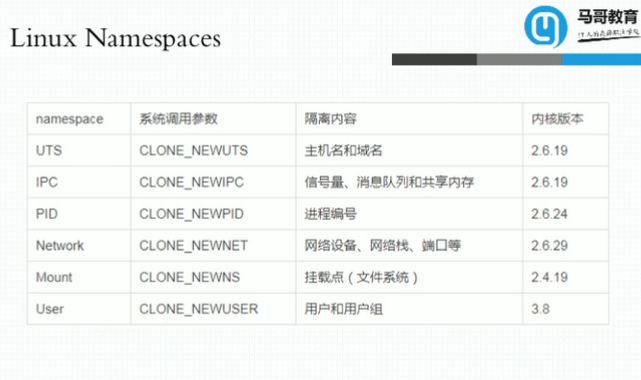
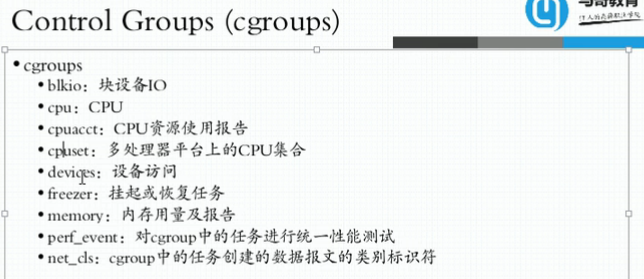

容器技术

jail，vserver(chroot)

**主机级虚拟化**

```
.Type-I
.Type-II
```

## 容器级虚拟化

UTS Mount IPC

PID(进程树)

User 每个空间内伪装成一个root用户，真正回到宿主机上仍然是个普通用户，但是在隔离空间内可以为所欲为

Net 

同一内核上创建多个名称空间namespaces，以达到内核级别的隔离

clone(),cetns(),



**Control Groups (cgroups)**

内存属于不可压缩资源，所以在内核名称空间上对整体资源上做比例分配或在单一资源上进行限制性分配



## LXC(LinuX Container)

.lxc-create, template 

docker是lxc的增强版

## Moby，CNCF

nmp

machine+swarm+compose

mesos+marathon

kubernetes -->k8s

libcontainer -->runC

