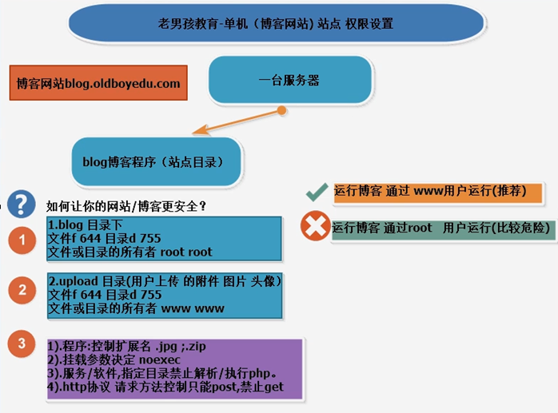

## Linux系统12位权限体系

2019-07-15 分类：[运维基础](https://www.increase93.com/?cat=5) 阅读(112) 评论(0)

1. **rwx是啥**

   1. ### rwx含义

- **read 可读**
- **write 可写**
- **execute 命令 or 脚本**

1. ### linux如何知道我对某个文件或目录有什么权限？

**1.你是谁显示当前用户**

**2.你和这个文件有什么关系主人家人陌生人**

**3.根据你和这个文件的关系找对应的权限**

1. ## rwx对应的数字 及计算方法 rwxr-xr-x

**rwx 权限位表示**

**r    read        读 4**

**w    write        写 2**

**x    execute        执行 1**

**-                 没有权限 0**

**权限位计算**

**-rwxr-xr-x        755**

**-r-x------         500**

**-rw-------        600**

**-rw-r--r--        644**

**-rwxrwxrwx        777**

**644        rw-r--r--**

**755        rwxr-xr-x**

**400        r--------**

**650        rw-r-x---**

**404        r-----r--**

**403        r------wx**

1. ## chmod与chown命令的使用

   1. ### chmod命令

- **chmod：change mode，修改权限，-R 递归修改**

1. ### 字母形式表示权限

- 用户的表示方法：

u-user(文件的所有者-主人）

g--group(用户属于的组-家人)

o-others(其他人
隔壁老王-陌生人)

- 授予权限：

+添加权限

-去掉某一个权限

=先去掉原有的权限，然后在赋予新的权限 chmod u=rx test.sh

- 例子：添加文件的属组（家庭）的写入与执行权限

[root@oldboyedu oldboy]# chmod g+wx oldgirl

[root@oldboyedu oldboy]# ls -ld oldgirl

-rw-rwxr--. 1 root root 0 Oct 18 15:54 oldgirl

- 删除文件的属主（主人）的写入权限

[root@oldboyedu oldboy]# chmod u-w oldgirl

[root@oldboyedu oldboy]# ls -ld oldgirl

-r--rwxr--. 1 root root 0 Oct 18 15:54 oldgirl

- 修改文件的权限为属主用户所有权限

[root@oldboyedu oldboy]# chmod =rwx oldgirl
（默认修改的是属主用户）

[root@oldboyedu oldboy]# ls -ld oldgirl

-rwxr-xr-x. 1 root root 0 Oct 18 15:54 oldgirl

1. ### 数字形式表示权限

- **权限对应的数字：**

**r--- 4**

**w---- 2**

**x----- 1**

**- ==== 0**

- **使用数字授予权限：**

**rwxr-xr-x 755**

**chmod 755 test.sh**

- **例子：**

**[root@oldboyedu oldboy]# chmod 644 oldgirl**

**[root@oldboyedu oldboy]# ls -ld oldgirl**

**-rw-r--r--. 1 root root 0 Oct 18 15:54 oldgirl**

**[root@oldboyedu oldboy]# chmod 777 oldgirl**

**[root@oldboyedu oldboy]# ls -ld oldgirl**

**-rwxrwxrwx. 1 root root 0 Oct 18 15:54 oldgirl**

**[root@oldboyedu oldboy]# chmod 70 oldgirl**

**[root@oldboyedu oldboy]# ls -ld oldgirl**

**----rwx---. 1 root root 0 Oct 18 15:54 oldgirl**

**[root@oldboyedu oldboy]# chmod 7 oldgirl （默认从其他用户位开始修改）**

**[root@oldboyedu oldboy]# ls -ld oldgirl**

**-------rwx. 1 root root 0 Oct 18 15:54 oldgirl**

1. ### chown命令

- **change own，修改属主属组，-R 递归修改**

**[root@oldboyedu oldboy]# chown -R oldboy.oldboy /oldboy**

**[root@oldboyedu oldboy]# ls -ld /oldboy**

**drwxr-xr-x. 3 oldboy oldboy 0 Oct 18 15:54 oldboy**

1. ## 对于文件来说r w x 是什么含义

- **创建测试环境（root用户）**

**[root@oldboyedu oldboy]# echo 'hostname' > lidao.sh**

**[root@oldboyedu oldboy]# cat lidao.sh**

**hostname**

**注：修改文件权限都是在root用户下进行**

- **显示文件r权限**
- **文件权限为r，文件有读取权限，但是没有写入权限和执行权限**

**[oldboy@oldboyedu oldboy]$ ls -ld lidao.sh**

**-rw-r--r--. 1 root root 9 Oct 18 17:19 lidao.sh**

**[oldboy@oldboyedu oldboy]$ cat lidao.sh**

**hostname**

**[oldboy@oldboyedu oldboy]$ echo 'hostname' > lidao.sh**

**-bash: lidao.sh: Permission denied**

**[oldboy@oldboyedu oldboy]$ ./lidao.sh**

**-bash: ./lidao.sh: Permission denied**

- **文件权限为rw，文件有读取权限和写入权限，但是没有执行权限**

**[oldboy@oldboyedu oldboy]$ ls -ld lidao.sh**

**-rw-r--rw-. 1 root root 9 Oct 18 17:19 lidao.sh**

**[oldboy@oldboyedu oldboy]$ cat lidao.sh**

**hostname**

**[oldboy@oldboyedu oldboy]$ echo 'hostname' > lidao.sh**

**[oldboy@oldboyedu oldboy]$ ./lidao.sh**

**-bash: ./lidao.sh: Permission denied**

- **文件权限为rx，文件有读取权限和执行权限，但是没有写入权限**

**[oldboy@oldboyedu oldboy]$ ls -ld lidao.sh**

**-rw-r--r-x. 1 root root 9 Oct 18 17:19 lidao.sh**

**[oldboy@oldboyedu oldboy]$ cat lidao.sh**

**hostname**

**[oldboy@oldboyedu oldboy]$ echo 'hostname' > lidao.sh**

**-bash: lidao.sh: Permission denied**

**[oldboy@oldboyedu oldboy]$ ./lidao.sh**

**oldboyedu**

- **修改文件w权限**
- **文件权限为w，文件有写入权限，但是没有读取权限和执行权限(vim 修改文件内容强制保存但是会覆盖之前的内容)**

**[oldboy@oldboyedu oldboy]$ ls -ld lidao.sh**

**-rw-r---w-. 1 root root 9 Oct 18 17:02 lidao.sh**

**[oldboy@oldboyedu oldboy]$ echo 'hostname' > lidao.sh**

**[oldboy@oldboyedu oldboy]$ cat lidao.sh**

**cat: lidao.sh: Permission denied**

**[oldboy@oldboyedu oldboy]$ ./lidao.sh**

**-bash: ./lidao.sh: Permission denied**

- **文件权限为wx，文件有写入权限，但是没有读取权限和执行权限**

**[oldboy@oldboyedu oldboy]$ ls -ld lidao.sh**

**-rw-r---wx. 1 root root 9 Oct 18 17:18 lidao.sh**

**[oldboy@oldboyedu oldboy]$ echo 'hostname' > lidao.sh**

**[oldboy@oldboyedu oldboy]$ cat lidao.sh**

**cat: lidao.sh: Permission denied**

**[oldboy@oldboyedu oldboy]$ ./lidao.sh**

**bash: ./lidao.sh: Permission denied**

- **执行文件x权限**
- **文件权限为x，文件没有执行权限**

**[oldboy@oldboyedu oldboy]$ ls -ld lidao.sh**

**-rw-r----x. 1 root root 9 Oct 18 17:02 lidao.sh**

**[oldboy@oldboyedu oldboy]$ ./lidao.sh**

**bash: ./lidao.sh: Permission denied**

- **对于文件来说：**

**r 是否能查看文件内容**

**w 是否能修改文件的内容，需要r权限配合 rw**

**只有w的时候vim强制修改文件内容，会导致源文件内容清空**

**x 是否能运行命令或脚本的权限，需要r权限配合**

**root 默认对文件rw权限，默认没有执行权限**

1. ## 对于目录来说r w x 是什么含义

- **创建测试环境（root用户）**

**[root@oldboyedu oldboy]# mkdir -p /oldboy/oldboyedu**

**[root@oldboyedu oldboy]# touch /oldboy/oldboyedu/alex{01..5}.txt**

**[root@oldboyedu oldboy]# ls /oldboy/oldboyedu/**

**alex01.txt alex02.txt alex03.txt alex04.txt alex05.txt**

**[root@oldboyedu oldboy]# chown oldboy.oldboy /oldboy/oldboyedu/**

- **目录r权限**
- **修改目的权限为744（root下进行）**

**[root@oldboyedu oldboy]# chmod o=r oldboyedu/**

**[root@oldboyedu oldboy]# ls -ld oldboyedu/**

**drwxr--r--. 2 oldboy oldboy 96 Oct 18 17:51 oldboyedu/**

- **权限为r时，不能修改、删除、创建目录内的文件和进入目录**

**[oldboy@oldboyedu oldboy]$ cd oldboyedu/**

**-bash: cd: oldboyedu/: Permission denied**

**[oldboy@oldboyedu oldboy]$ ls oldboyedu/**

**ls: cannot access oldboyedu/alex01.txt: Permission denied**

**ls: cannot access oldboyedu/alex02.txt: Permission denied**

**ls: cannot access oldboyedu/alex03.txt: Permission denied**

**ls: cannot access oldboyedu/alex04.txt: Permission denied**

**ls: cannot access oldboyedu/alex05.txt: Permission denied**

**alex01.txt alex02.txt alex03.txt alex04.txt alex05.txt**

**[oldboy@oldboyedu oldboy]$ ll oldboyedu/**

**ls: cannot access oldboyedu/alex01.txt: Permission denied**

**ls: cannot access oldboyedu/alex02.txt: Permission denied**

**ls: cannot access oldboyedu/alex03.txt: Permission denied**

**ls: cannot access oldboyedu/alex04.txt: Permission denied**

**ls: cannot access oldboyedu/alex05.txt: Permission denied**

**total 0**

**-????????? ? ? ? ? ? alex01.txt**

**-????????? ? ? ? ? ? alex02.txt**

**-????????? ? ? ? ? ? alex03.txt**

**-????????? ? ? ? ? ? alex04.txt**

**-????????? ? ? ? ? ? alex05.txt**

- **目录w权限**
- **先修改目的权限为742（root下进行）**

**[root@oldboyedu oldboy]# chmod o=w oldboyedu/**

**[root@oldboyedu oldboy]# ls -ld oldboyedu/**

**drwxr---w-. 2 oldboy oldboy 96 Oct 18 17:51 oldboyedu/**

- **权限为w时，不能修改、删除、创建目录内的文件和进入目录**

**[oldboy@oldboyedu oldboy]$ ll oldboyedu/**

**ls: cannot open directory oldboyedu/: Permission denied**

**[oldboy@oldboyedu oldboy]$ cd oldboyedu/**

**-bash: cd: oldboyedu/: Permission denied**

**[oldboy@oldboyedu oldboy]$ rm -fr oldboyedu/alex01.txt**

**rm: cannot remove 'oldboyedu/alex01.txt': Permission denied**

**[oldboy@oldboyedu oldboy]$ touch oldboyedu/oldboy.txt**

**touch: cannot touch 'oldboyedu/oldboy.txt': Permission denied**

- **目录x权限**
- **先修改目的权限为741（root下进行）**

**[root@oldboyedu oldboy]# chmod o=x oldboyedu/**

**[root@oldboyedu oldboy]# ls -ld oldboyedu/**

**drwxr----x. 2 oldboy oldboy 96 Oct 18 17:51 oldboyedu/**

- **权限为x时，不能查看、修改、删除、创建目录内的文件，但可以进入目录**

**[oldboy@oldboyedu oldboy]$ ls -ld oldboyedu/**

**d--xr--r-x. 2 oldboy oldboy 96 Oct 18 17:51 oldboyedu/**

**[oldboy@oldboyedu oldboy]$ ls oldboyedu/**

**ls: cannot open directory oldboyedu/: Permission denied**

**[oldboy@oldboyedu oldboy]$ ll oldboyedu/**

**ls: cannot open directory oldboyedu/: Permission denied**

**[oldboy@oldboyedu oldboy]$ cd oldboyedu/**

**[oldboy@oldboyedu oldboyedu]$ ll -lih**

**ls: cannot open directory .: Permission denied**

- **对于目录来说：**

**r    显示目录的内容 ls 只有r的时候目录中文件属性都是以?????显示        需要x配合**

**w    在目录中创建删除重命名文件权限                                需要x配合**

**x    是否能进入到目录权限 cd 是否能查看或修改目录中文件属性的权限**

1. ## 权限错误及原因

**当前用户是oldboy**

**cat /etc/shadow**

**权限拒绝，没有文件r（读）权限。**

**rm -f /etc/hosts**

**权限拒绝，没有目录/etc的执行权限**

**ls -l /root**

**权限拒绝，没有目录的权限**

1. ## linux系统默认权限控制命令umask

   1. ### umask是什么？

- **控制linux里面创建文件或目录的默认的权限**

1. ### umask怎么计算？

- **通过文件或目录的最大权限 666 777减去umask**
- **对于文件的默认权限-umask如果有奇数位奇数位在减完后还要加1**

1. ### umask如何修改？

- **临时：umask 022**
- **永久：修改/etc/profile文件**

1. ## 网站权限-通过控制权限让网站安全

   1. ### linux系统默认权限

- **对于文件来说默认什么权限比较好？**

**所有者家庭隔壁老王**

**rw- r-- r-- 644**

- **对于目录来说默认什么权限比较好？**

**所有者家庭隔壁老王**

**rwx r-x r-x 755**

1. ### 网站比较安全的权限

- **网站权限**

**网站是以www用户的身份运行**

**file 644 dir 755 root root**

**upload file 644 dir 755 www www**

- **程序代码控制**

**上传上来文件无法运行**

**上传上来没有执行权限**

1. ### 一台服务器如何控制安全

- **/app/blog blog目录站点目录（存放的是网站代码页面）**
- **模拟环境**

**mkdir -p /app/blog /app/blog/uploads**

**touch /app/blog/{lidao.jpg,sfn.mp4}**

**useradd www**

- **切换到目录**

**[root@oldboyedu ~]# cd /app/blog/**

**[root@oldboyedu blog]# ll**

**total 0**

**-rw-r--r--. 1 root root 0 Oct 19 09:25 lidao.jpg**

**-rw-r--r--. 1 root root 0 Oct 19 09:25 sfn.mp4**

**drwxr-xr-x. 2 root root 21 Oct 19 16:32 uploads**

- **在www用户下创建文件**

**[www@oldboyedu blog]$ touch uploads/aaa.avi**

**touch: setting times of 'uploads/': Permission denied**

**touch: cannot touch 'aaa.avi': Permission denied**

- **解决Permission denied**
- **给uploads目录其他人上面+w权限(权限大，不推荐使用)**
- **root 用户环境**

**[root@oldboyedu ~]# chmod o+w /app/blog/uploads/**

**[root@oldboyedu ~]# ll -d /app/blog/uploads/**

**drwxr-xrwx. 2 root root 6 Oct 20 16:23 /app/blog/uploads/**

- **www 用户环境**

**[www@oldboyedu blog]$ ll -d /app/blog/uploads/**

**drwxr-xrwx. 2 root root 6 Oct 20 16:42 /app/blog/uploads/**

**[www@oldboyedu blog]$ touch /app/blog/uploads/aaa.avi**

**[www@oldboyedu blog]$ ll -d /app/blog/uploads/aaa.avi**

**-rw-rw-r--. 1 www www 0 Oct 20 16:45 /app/blog/uploads/aaa.avi**

**注：在other用户给w权限，相当于其他的用户也可以对目录里面的内容进行修改**

- **目录所有者改为www 普通用户(推荐使用)**
- **root用户环境**

**[root@oldboyedu /]# ll -d /app/blog/uploads/**

**drwxr-xr-x. 2 root root 6 Oct 20 16:48 /app/blog/uploads/**

**[root@oldboyedu /]# chown www.www /app/blog/uploads/**

**[root@oldboyedu /]# ll -d /app/blog/uploads/**

**drwxr-xr-x. 2 www www 6 Oct 20 16:48 /app/blog/uploads/**

- **www用户环境**

**[www@oldboyedu blog]$ ll -d uploads/**

**drwxr-xr-x. 2 www www 6 Oct 20 16:48 uploads/**

**[www@oldboyedu blog]$ touch uploads/aaa.avi**

**[www@oldboyedu blog]$ ll -d uploads/aaa.avi**

**-rw-rw-r--. 1 www www 0 Oct 20 16:52 uploads/aaa.avi**

**注：把uploads目录归属普通用户，其他用户就没有修改权限，相对安全。**

1. ### 网站安全配置权限 

- 网站以www用户运行，不以root运行

[www@oldboyedu app]$ ll -d /app/

drwxr-xr-x. 3 root root 18 Oct 20 16:42 /app/

[www@oldboyedu app]$ whoami

www

- blog目录

file 644 root root

dir 755 root root

站点目录文件给默认的权限，可以root用户运行

- uploads上传目录

file 644 www www

dir 755 www www

其他用户上传文件目录给默认的权限，但是目录的所有者要属于运行网站的用户

1. ## 文件系统属性（文件隐藏属性）

   1. ### chattr 授予隐藏属性

- **授予文件或目录隐藏的权限**
- **a (append 只能追加) 如果设置了这个权限只能追加不能删除不能修改**
- **i( immutable 无敌) 无法修改无法删除**

1. ### lsattr 查看隐藏属性

- **查看当前目录所有文件及目录的隐藏属性**

**[root@oldboyedu oldboy]# lsattr us/**

**---------------- us/us**

- **查看指定文件的隐藏属性**

**[root@oldboyedu oldboy]# lsattr oldboy.txt**

**---------------- oldboy.txt**

1. ### chattr 增加属性

**change attr 属性**

1. ### chattr ± a 增加文件a属性

**a == append ( 增加)**

**给文件追加a属性，只能向文件追加内容与查看内容。不能修改文件内容，不能删除文件。（保护重要的配置文件）**

**重要配置文件加上a属性**

**[root@oldboyedu ~]# ls -ld /etc/passwd /etc/shadow /etc/group /etc/gshadow**

**-rw-r--r--. 1 root root 462 Oct 19 09:25 /etc/group**

**----------. 1 root root 364 Oct 19 09:25 /etc/gshadow**

**-rw-r--r--. 1 root root 878 Oct 19 09:25 /etc/passwd**

**----------. 1 root root 618 Oct 19 09:25 /etc/shadow**

**[root@oldboyedu oldboy]# lsattr oldboy.txt**

**---------------- oldboy.txt**

**[root@oldboyedu oldboy]# chattr +a oldboy.txt**

**[root@oldboyedu oldboy]# lsattr oldboy.txt**

**-----a---------- oldboy.txt**

**[root@oldboyedu oldboy]# > oldboy.txt**

**-bash: oldboy.txt: Operation not permitted**

**[root@oldboyedu oldboy]# rm -fr oldboy.txt**

**rm: cannot remove 'oldboy.txt': Operation not permitted**

**[root@oldboyedu oldboy]# echo 'oldboy' >> oldboy.txt**

1. ### chattr ± i 增加文件i属性

- **i=== immutable (不可改变)**
- **给文件追加i属性，只能查看内容。，不能删除文件，不能修改文件内容（保护重要的命令）**

**[root@oldboyedu oldboy]# lsattr oldboy.txt**

**---------------- oldboy.txt**

**[root@oldboyedu oldboy]# chattr +i oldboy.txt**

**[root@oldboyedu oldboy]# lsattr oldboy.txt**

**----i----------- oldboy.txt**

**[root@oldboyedu oldboy]# rm -fr oldboy.txt**

**rm: cannot remove 'oldboy.txt': Operation not permitted**

**[root@oldboyedu oldboy]# > oldboy.txt**

**-bash: oldboy.txt: Permission denied**

**[root@oldboyedu oldboy]# echo 'linux' >> oldboy.txt**

**-bash: oldboy.txt: Permission denied**

**注：可以改命令的名字，隐藏命令。**

1. ## 了解特殊权限

   1. ### suid setuid

- **作用:运行某一个命令的时候相当于这个命令的所有者(root)**
- **S s -rwsr-xr-x**
- **设置方法：chmod u+s /bin/rm 或 chmod 4755 /bin/rm**
- **危险：所有用户运行命令的时候都相当于是root，passwd命令**

**[root@oldboyedu ~]# ll -d /tmp/ /usr/bin/passwd /usr/bin/locate**

**drwxrwxrwt. 29 root root 4096 Oct 19 10:42 /tmp/**

**1777**

**-rwx--s--x 1 root slocate 40520 Apr 11 2018 /usr/bin/locate**

**2711**

**-rwsr-xr-x. 1 root root 27832 Jun 10 2014 /usr/bin/passwd**

**4755**

- **/usr/bin/passwd 特殊文件**
- **系统规定只有root用户才能更改指定用户的密码，其他用户不能修改其他用户的密码。**

**[www@oldboyedu app]$ passwd www**

**passwd: Only root can specify a user name.**

- **普通用户只能修改自己的密码(条件:8位字符，与上个密码不能相似)**

**[oldboy@oldboyedu ~]$ passwd**

**Changing password for user oldboy.**

**Changing password for oldboy.**

**(current) UNIX password: 需要修改密码**

**New password: 新密码**

**Retype new password: 在输入一次**

**passwd: all authentication tokens updated successfully.更改密码成功**

- **root用户可以清空其他用户密码**

**[root@oldboyedu ~]# passwd -d oldboy**

**Removing password for user oldboy.**

**passwd: Success**

- **大S与小s的区别**
- **大S：原来文件没有执行(X)权限，加上s权限就是S**

**[root@oldboyedu oldboy]# ll**

**-rw-r--r--. 1 root root 9 Oct 20 20:24 lidao.sh**

**[root@oldboyedu oldboy]# chmod u+s lidao.sh**

**[root@oldboyedu oldboy]# ll**

**-rwSr--r--. 1 root root 9 Oct 20 20:24 lidao.sh**

- **小s：原来文件有执行(X)权限，加上s权限就是s**

**[root@oldboyedu oldboy]# ll**

**-rwxrwxrwx. 1 root root 9 Oct 20 20:24 lidao.sh**

**[root@oldboyedu oldboy]# chmod u+s lidao.sh**

**[root@oldboyedu oldboy]# ll**

**-rwsrwxrwx. 1 root root 9 Oct 20 20:24 lidao.sh**

- **s 权限命令模拟实战(rm)**
- **正常情况下oldboy用户删不了etc/oldboy.txt**
- **root用户**

**[root@oldboyedu ~]# touch /etc/oldboy.txt**

**[root@oldboyedu ~]# ll /etc/oldboy.txt**

**-rw-r--r--. 1 root root 0 Oct 20 20:06 /etc/oldboy.txt**

**[root@oldboyedu ~]# ll /bin/rm**

**-rwxr-xr-x. 1 root root 62864 Apr 11 2018 /bin/rm**

- **oldboy用户**

**[oldboy@oldboyedu ~]$ ll /bin/rm**

**-rwxr-xr-x. 1 root root 62864 Apr 11 2018 /bin/rm**

**[oldboy@oldboyedu ~]$ ll /etc/oldboy.txt**

**-rw-r--r--. 1 root root 0 Oct 20 20:06 /etc/oldboy.txt**

**[oldboy@oldboyedu ~]$ rm -fr /etc/oldboy.txt**

**rm: cannot remove '/etc/oldboy.txt': Permission denied**

- **root用户给了rm命令s权限，就相当于其他用户以root的方式执行了rm命令(御赐的尚方宝剑)**
- **root用户**

**[root@oldboyedu ~]# chmod u+s /bin/rm**

**[root@oldboyedu ~]# ll /bin/rm**

**-rwsr-xr-x. 1 root root 62864 Apr 11 2018 /bin/rm**

- **oldboy用户**

**[oldboy@oldboyedu ~]$ rm -fr /etc/oldboy.txt**

1. ### sticky粘滞位 1777 /tmp目录

- **任何人都可以在这个目录里面创建文件(原来的权限是777)**
- **每个人只能管理自己的文件，其他人的处理不了**
- **/tmp/ 特殊目录**

**/tmp每个用户都可以创建文件，但是每个人只能管理自己的文件**

**/tmp t sticky 粘滞位**

- **root用户**

**[root@oldboyedu /]# ll -d /tmp/**

**drwxrwxrwt. 7 root root 93 Oct 20 20:03 /tmp/**

**[root@oldboyedu /]# chmod 777 /tmp/**

**[root@oldboyedu /]# ll -d /tmp/**

**drwxrwxrwx. 7 root root 93 Oct 20 20:03 /tmp/**

**[root@oldboyedu /]# touch /tmp/system.passwd**

- **删除一个文件看文件所在的目录的权限**
- **oldboy用户**

**[oldboy@oldboyedu ~]$ ll -d /tmp/system.passwd**

**-rw-r--r--. 1 root root 0 Oct 20 20:39 /tmp/system.passwd**

**[oldboy@oldboyedu ~]$ rm -fr /tmp/system.passwd**

**注：因为目录是777权限，所以可以删除文件**

- **添加目录t权限，其他用户不能删除文件**
- **root用户**

**[root@oldboyedu /]# chmod o+t /tmp/**

**[root@oldboyedu /]# ll -d /tmp/**

**drwxrwxrwt. 7 root root 114 Oct 20 20:39 /tmp/**

**[root@oldboyedu /]# touch /tmp/system.passwd**

- **oldboy用户**

**[oldboy@oldboyedu ~]$ rm -fr /tmp/system.passwd**

**rm: cannot remove '/tmp/system.passwd': Operation not permitted**

**注：目录添加t权限，所以其他用户不能删除文件**

1. ### stat 查看文件属性

- /tmp/

[root@oldboyedu ~]# stat /tmp/

File: '/tmp/'

Size: 114     Blocks: 0 IO Block: 4096 directory

Device: 805h/2053d    Inode: 16797768 Links: 7

Access: (1777/drwxrwxrwt) Uid: ( 0/ root) Gid: ( 0/ root)

Context: system_u:object_r:tmp_t:s0

Access: 2018-10-20 20:54:57.799095651 +0800

Modify: 2018-10-20 21:32:16.831163981 +0800

Change: 2018-10-20 21:32:16.831163981 +0800

Birth: -

- /usr/bin/locate

[root@oldboyedu ~]# stat /usr/bin/locate

File: '/usr/bin/locate'

Size: 40520     Blocks: 80 IO Block: 4096 regular file

Device: 805h/2053d    Inode: 595 Links: 1

Access: (2711/-rwx--s--x) Uid: ( 0/ root) Gid: ( 21/ slocate)

Context: system_u:object_r:bin_t:s0

Access: 2018-04-11 11:46:47.000000000 +0800

Modify: 2018-04-11 11:46:47.000000000 +0800

Change: 2018-10-20 21:32:16.113163959 +0800

Birth: -

- /usr/bin/passwd

[root@oldboyedu ~]# stat /usr/bin/passwd

File: '/usr/bin/passwd'

Size: 27832     Blocks: 56 IO Block: 4096 regular file

Device: 805h/2053d    Inode: 480050 Links: 1

Access: (4755/-rwsr-xr-x) Uid: ( 0/ root) Gid: ( 0/ root)

Context: system_u:object_r:passwd_exec_t:s0

Access: 2014-06-10 14:27:56.000000000 +0800

Modify: 2014-06-10 14:27:56.000000000 +0800

Change: 2018-09-11 08:14:28.067984563 +0800

Birth: -

1. ### sgid locate

- **作用:运行某一个命令的时候相当于属于这个命令所在家庭（用户组）(root)**

1. ## 本章知识点总结

- r权限
- **w权限**
- **x权限**
- **chmod命令**
- **chown命令**
- **umask命令**
- **怎样让网站更安全**
- **chattr命令**
- **lsattr命令**
- **Ss权限**
- **t权限**