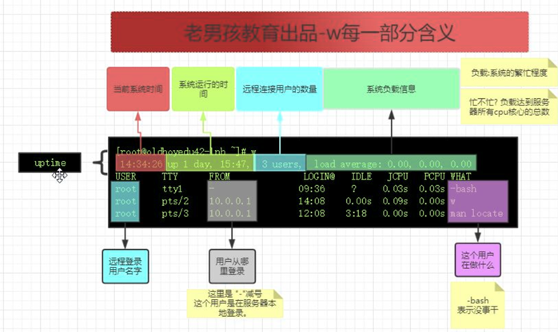

## Linux系统用户管理体系

2019-07-15 分类：[运维基础](https://www.increase93.com/?cat=5) 阅读(155) 评论(0)

1. ## 用户分类

   1. ### UID

- **user id 身份证号码**

1. ### GID

- **group id用户组id**

1. ### root 用户（皇帝）

- **UID：0**

1. ### 虚拟用户

- **傀儡用户**

**cent6 UID：1-499**

**cent7 UID：1-999**

**用户的命令解释器/sbin/nologin**

**每个程序、服务运行的时候都需要一个用户**

**傀儡用户不需要用来登录系统**

1. ### 普通用户

**cent6 UID：500+**

**cent7 UID：1000+**

1. ### 常用的命令解释器

**cat /etc/shells**

**/bin/sh             默认**

**/bin/bash             默认**

**/sbin/nologin      虚拟用户**

**/bin/dash             ubuntu**

**/bin/csh              unix**

**/bin/tsh                 unix**

1. ## 用户相关的配置文件

   1. ### /etc/passwd 用户的信息

**root        😡        :0        :0:        root:         /root:     /bin/bash**

**bin            😡        :1        :1:        bin:            /bin:         /sbin/nologin**

**daemon        😡        :2        :2:        daemon:         /sbin:         /sbin/nologin**

**adm            😡        :3        :4:        adm:         /var            /adm:/sbin/nologin**

**lp            😡        :4        :7:        lp:             /var            /spool/lpd:/sbin/nologin**

**用户名密码     UID GID 用户说明信息用户家目录用户使用的shell解释器**

1. ### /etc/shadow 用户密码信息

**[root@oldboyedu ~]# cat /etc/shadow**

**root:$6$Qi0pQwWr4OrUdvqy$vgoXqp6u1p/mGcdXEZgNJ/n8e4p6Uj8e/Xend1TvqhfBx/cncFyYjCUOSMcGkpjqfEZLLmXXA9y99gv.CGrNG/::0:99999:7:::**

1. ### /etc/group 用户的用户组信息

**[root@oldboyedu ~]# cat /etc/group**

**root:x:0:**

**bin:x:1:**

**daemon:x:2:**

**sys:x:3:**

**adm:x:4:**

1. ### /etc/gshadow 用户组密码信息

**[root@oldboyedu ~]# cat /etc/gshadow**

**root:::**

**bin:::**

**daemon:::**

**sys:::**

**adm:::**

1. ## 与用户相关的目录

   1. ### /etc/skel

- **/etc/skel 新用户家目录模板**

**[root@oldboyedu ~]# ll /etc/skel -a**

**total 24**

**drwxr-xr-x. 2 root root 62 Apr 11 2018 .**

**drwxr-xr-x. 74 root root 8192 Oct 20 21:32 ..**

**-rw-r--r--. 1 root root 18 Apr 11 2018 .bash_logout        #用户退出执行命令 ctrl+d**

**-rw-r--r--. 1 root root 193 Apr 11 2018 .bash_profile     #/etc/profile 别名，变量**

**-rw-r--r--. 1 root root 231 Apr 11 2018 .bashrc            #/etc/bashrc 别名**

- **创建新用户的过程**

**useradd oldboy**

**1）创建家目录**

**2）把/etc/skel目录下的内容复制到家目录**

**3）修改权限所有者**

- **请问如下登录环境故障的原理及解决办法？ -bash-4.1$(CentOS6.x) -bash-4.2$(CentOS7.x)**

**原因:这个用户的家目录下面的环境变量文件被删除了 ~/.bashrc ~/.bash_profile**

**模拟之前注释/etc/profile中的PS1**

**第1个里程碑-切换到有故障的用户**

**第2个里程碑-故障原因-用户环境变量有关的文件 .bashrc .bash_profile**

**第3个里程碑-/etc/skel 里面存放着模板**

**第4个里程碑-/etc/skel/.bash\* 复制到当前用户**

**第5个里程碑-重新登录该用户alex**

1. ## 用户管理的命令

   1. ### 用户相关命令

- **useradd 添加用户**

**-u 指定用户的uid(数字 身份证号码)**

**-s 指定用户使用的shell**

**    /bin/bash 默认**

**    /sbin/nologin 手动添加一个傀儡用户 虚拟用户**

**-M 表示不创建家目录 一般创建虚拟用户使用**

**-g 指定 用户属于的组（组的名字) 添加用户的时候 默认创建一个与用户名一样的家庭**

- **添加一个用户lidao666指定uid为888 禁止用户登录系统 不创建家目录**

**[root@oldboyedu ~]# useradd -u 888 -s /sbin/nologin -M lidao**

**[root@oldboyedu ~]# id lidao**

**uid=888(lidao) gid=1002(lidao) groups=1002(lidao)**

**[root@oldboyedu ~]# grep lidao /etc/passwd**

**lidao:x:888:1002::/home/lidao:/sbin/nologin**

**显示有家目录但是不能登陆**

**[root@oldboyedu ~]# ll /home/lidao**

**ls: cannot access /home/lidao: No such file or directory**

- **userdel 删除用户**

**把这个用户/etc/passwd中注释**

**userdel 默认不删除用户的家目录和邮箱**

**-r 连窝端删除与用户有关的所有信息（家目录）**

- **usermod 修改用户的信息（这个用户已经存在）**

**-s 修改用户使用的shell**

**-g 属于的家庭用户组的名字主要组**

**-G 属于多个家庭附加组**

- **passwd 设置密码**

**--stdin 从管道中获取用户的密码（非交互式设置密码）**

**企业场景：用户及密码管理**

**密码要复杂 12位以上字母数字特殊字符**

**保存密码：**

**keepass (软件，密码存放在本地，本地保险柜)**

**lastpass （在线版本，银行的保险柜）**

**大的企业用户和密码统一管理（相当于活动目录(AD),openldap域）**

**动态密码：动态口令，第三方提供自己开发也很简单。**

- **chown 修改文件或目录所有者和属于的用户组**

**-R 递归修改文件或目录的所有者和用户组**

**chown oldboy oldboy.txt #只修改了文件的所有者**

**chown oldboy.oldboy oldboy.txt #修改了文件的所有者和属于的组**

1. ### 如何让系统更安全

**1.最小化（安装系统和软件）**

**2.保护好root（禁止root用户远程登录修改远程连接端口号22）**

**3.文件系统权限（给系统常用命令+i 给系统配置文件+a）**

**4.严格控制权限**

**5.给重要的文件或命令做一个指纹**

**文件的内容变化 === 指纹变化**

**检查所有人的文件是否相同**

**检查文件内容是否变化**

**给这个文件创建指纹**

**md5sum oldboy.txt**

**如何快速的对比指纹**

**把你的指纹记录下来**

**md5sum oldboy.txt >.txt**

**finger.txt是指纹库**

**如何进行对比**

**md5sum -c finger.txt**

**定时任务+md5sum定时检查**

1. ### 用户组相关

- **groupadd 创建用户组**

**-g 指定用户组的gid 数字**

1. ### 用户查询命令

- **id 查看用户的信息**

**一个用户是否存在**

**查询用户的 uid gid**

**属于哪个用户组**

- **w 显示系统中已经远程登录的用户**

- **last 哪个用户在什么时候 从哪里 远程登录你的系统 用户登录的信息**
- **lastlog 显示Linux中所有用户最近一次远程登录的信息**

1. ## Sudo临时让用户获得root权限

   1. ### su与su -区别

**- su 命令参数**

**表示切换用户的时候更新环境变量**

1. ### sudo是什么

**开发人员,其他人员，想临时使用：看系统的日志删除软件的日志人事添加用户 useradd(root)**

**普通用户想临时成为皇帝（root) 尚方宝剑**

1. ### sudo怎么用

- **sudo -l 查看当前用户的上方宝剑**
- **visudo 给用户授予尚方宝剑**

**语法检查功能**

**crontab -e (root) ==== vi /var/spool/cron/root**

**visudo ==== vim /etc/sudoers**

**授权某一个命令**

**visudo #到达第92行**

**oldboy ALL=(ALL) /bin/ls**

**授权多个命令**

**oldboy ALL=(ALL) /bin/ls, /bin/rm, /usr/sbin/useradd**

**排除某个命令**

**oldboy ALL=(ALL) /sbin/\*, ! /sbin/init 排除某个命令**

**授权所有命令并且不用密码**

**oldboy ALL=(ALL) NOPASSWD: ALL**

**oldboy是运维人员的用户就是你在使用**

**自己用的时候我不想输入密码（sudo)**

**授权所有命令**

**oldboy ALL=(ALL) NOPASSWD: ALL**

1. ### 记录用户的操作行为/日志审计

**齐治的堡垒机：商业产品**

**gateone web跳板机**

**python开发的开源的跳板机产品**

**开源跳板机(堡垒机) Jumpserver**

**alex写的crazyEYE**

1. ## 本章知识点总结

- **了解用户UID**
- **了解用户GID**
- **用户的相关的文件和目录**
- **用户与用户组管理的命令**
- **了解sudo**