## Linux系统磁盘管理体系

2019-07-15 分类：[运维基础](https://www.increase93.com/?cat=5) 阅读(290) 评论(0)

1. **磁盘知识体系**

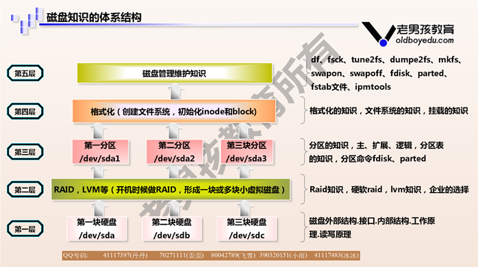

1. ## 磁盘结构

   1. ### 磁盘外部结构

- **磁盘主轴转速**

**rpm(round per minute)**

**10k rpm**

**15k rpm**

**5400 rpm**

**7200 rpm**

- **磁盘盘片（用于存储数据）**
- **磁头（用于读取数据）**
- **磁盘接口及类型**

**SATA 机械 给自己人使用的时候 备份 性能要求不高 大量容量 线下服务 10k rpm 2T 3T 4T**

**SAS 服务器标配 线上/生产环境使用 15k 300G 600G 10k 7.2k**

**PCI-E 大量的读写，要求很高的性能，数据量小**

**机械 和 固态**

**容量大价格低 容量小价格高**

**抗击打能力弱 抗击打能力高**

**读写速度稍慢io 读写速度很快io**

**数据恢复易 数据恢复难**

**使用时间无限 使用时间1-2w次**

1. ### 磁盘的内部组成

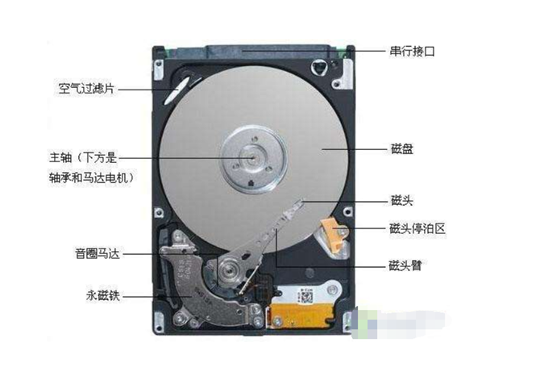

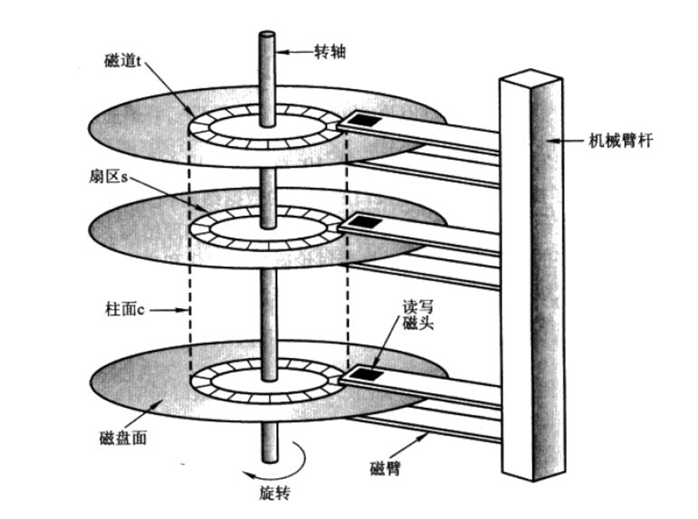

- **磁头（Head）**

**盘面数量==磁头数量**

**作用:用来写入和读取数据的**

**径向运动寻道**

- **磁道（Track）**

**从外面到里面最外面是0磁道**

- **扇区（Sector）**

**磁道上面的最小的单位**

**默认大小512字节**

- **柱面（Cylinder）**

**不同盘面上面的相同的磁道组成的圆柱体**

**不同盘面上的相同的呼啦圈组成的圆柱体**

**磁盘默认是按照柱面进行读写**

​    **磁头之间的切换速度接近于光速**

​    **磁头径向运动-寻道机械运动慢**

- **单元块（Units）**

**磁盘是按柱面进行读写的，表示一个柱面的大小**

- **计算磁盘大小**

**磁盘大小=柱面的大小\*柱面的数量**

**柱面的大小=一个磁道的大小\*磁头数量**

**一个磁道的大小=一个扇区的大小\*扇区数量/每个磁道**

**fdisk 查看磁盘详细信息**

**echo + bc**

**awk**

1. ## raid

   1. ### 磁盘阵列

**获得更大的容量**

**获得更高的性能**

**获得更好的冗余**

1. ### raid卡/阵列卡

**可以不用到机房现场，就能够坐在办公室里面远程连接并控制服务器的配件。**

1. ### 常用raid级别

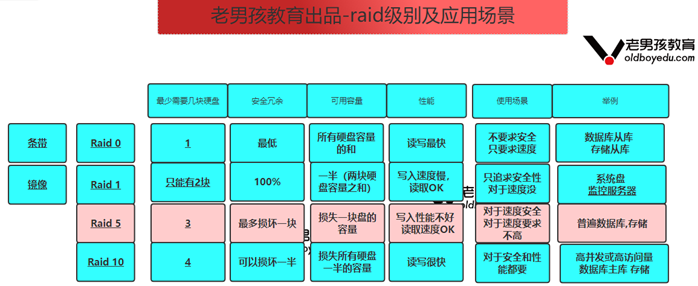

- **raid 0**

**具有最高的存储性能（磁盘容量不浪费，读写很快）,这些磁盘的总和**

​    **10\*1TB raid 0**

**要制作RAID 0至少要1块物理磁盘,不做raid不能安装系统**

**安全:任何一块硬盘损坏，所有的数据无法使用**

- **raid 1**

**镜像:损失50%的数据容量。例如2块1T的盘，做完RAID 1后容量为1T**

**raid只能2块硬盘**

**Mirror不能提高存储性能。理论上写性能和单盘相差不大**

- **raid 5**

**需要至少3块，损失一块硬盘**

​    **6\*600G**

**安全:最多可以损坏一块硬盘**

**性能：写入速度不快，读取Ok**

- **raid 10**

**最少4块硬盘,增加硬盘必须是2的倍数；所有硬盘容量的一半**

**安全:最多损坏一半硬盘**

**性能:写入和读取都很快**

- **高清图片:**

[**https://www.processon.com/view/link/5a0ba742e4b049e7f4fd8e2b**](https://www.processon.com/view/link/5a0ba742e4b049e7f4fd8e2b)

1. ## 磁盘分区

   1. ### 磁盘分区表

- **MBR位置:0磁头0磁道1扇区**

**前446字节 mbr 主引导记录**

**64字节的分区表**

**55AA 表示的是结束标记**

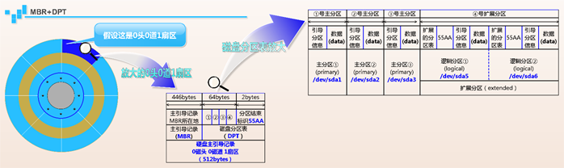

- **磁盘-盘片-mbr**
- **主分区 primary**

**一般一定要有**

**存放数据**

- **扩展分区 extend**

**最多1个**

**无法直接使用**

**注意：主分区+扩展分区一共最多可以有4个**

- **逻辑分区 logical**

**存放数据**

- **硬盘分区的设备名**

1. **磁盘**

​    **SAS/SATA/SCSI         /dev/sd?**

​    **第一块硬盘SAS            /dev/sda**

​    **第三块SATA硬盘            /dev/sdc**

1. **分区**

​    **主分区和扩展分区        1-4**

​    **逻辑分区         从5开始**

1. **例子**

​    **第1块sas硬盘的第一个主分区         /dev/sda1**

​    **第2块sata硬盘的第2个主分区            /dev/sdb2**

​    **第3块sata硬盘的第1个逻辑分区            /dev/sdc5**

1. ## fdisk磁盘分区实践

适用于磁盘小于2TB的磁盘，分区类型MBR，主分区*4或主分区*3+扩展分区（逻辑分区+…），分区后需要保存后生效

**模拟环境：**

**虚拟机增加一块10GB硬盘**

1. ###     第一个历程：添加硬盘

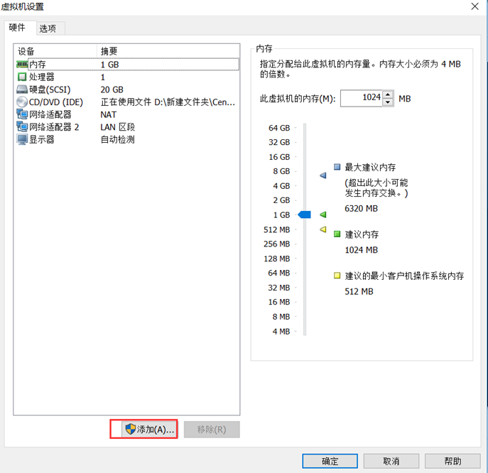

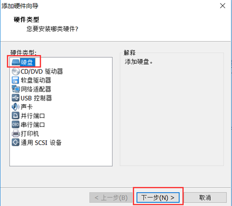

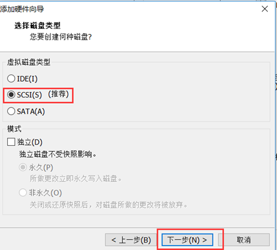

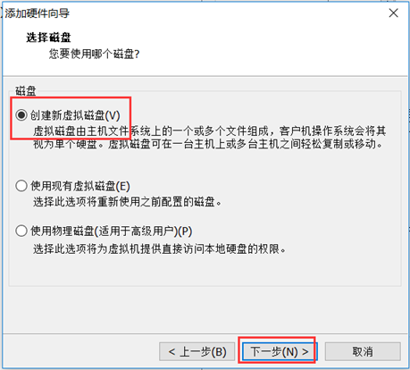

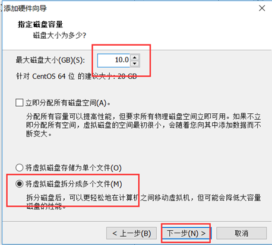

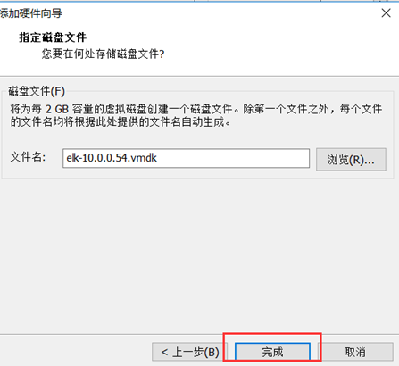

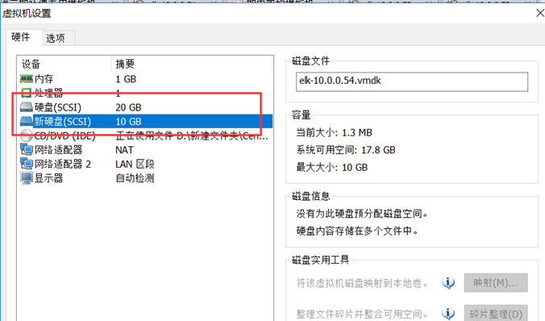

1. ###     第二个历程：利用命令进行分区处理

​    fdisk /dev/sdb

​    [root@oldboysh03 ~]# fdisk /dev/sdb

Welcome to fdisk (util-linux 2.23.2).

Changes will remain in memory only, until you decide to write them.

Be careful before using the write command.

Device does not contain a recognized partition table

Building a new DOS disklabel with disk identifier 0xbe73ea13.

Command (m for help):

​    Command (m for help): m

Command action

c toggle the dos compatibility flag      --- 磁盘分区模式有关系

d delete a partition                             --- 删除分区

g create a new empty GPT partition table --- 创建一个GPT分区（新增）

l list known partition types --- 列出已知分区类型

n add a new partition --- 创建一个新的分区

p print the partition table --- 输出显示分区表信息

q quit without saving changes --- 不保存退出

t change a partition's system id --- 改变分区系统id号码

w write table to disk and exit --- 保存退出

​    m print this menu --- 命令选项

​    分区具体过程（分4个主分区）

​    \1. 输入n进行分区

​     有时输入信息不正确，利用ctrl+u ctrl+backspace进行错误信息删除

​     Partition type:

p primary (0 primary, 0 extended, 4 free)

e extended

\2. 输入p创建主分区

​    Partition number (1-4, default 1): 1

First sector (2048-20971519, default 2048):

Using default value 2048

Last sector, +sectors or +size{K,M,G} (2048-20971519, default 20971519): +2G

Partition 1 of type Linux and of size 2 GiB is set

Command (m for help): p

Disk /dev/sdb: 10.7 GB, 10737418240 bytes, 20971520 sectors

Units = sectors of 1 * 512 = 512 bytes

Sector size (logical/physical): 512 bytes / 512 bytes

I/O size (minimum/optimal): 512 bytes / 512 bytes

Disk label type: dos

Disk identifier: 0xbe73ea13

Device Boot Start End Blocks Id System

/dev/sdb1 2048 4196351 2097152 83 Linux

Command (m for help): n

Partition type:

p primary (3 primary, 0 extended, 1 free)

e extended

Select (default e): e

Selected partition 4

First sector (12584960-20971519, default 12584960):

Using default value 12584960

Last sector, +sectors or +size{K,M,G} (12584960-20971519, default 20971519): +4G

Value out of range.

Last sector, +sectors or +size{K,M,G} (12584960-20971519, default 20971519):

Using default value 20971519

Partition 4 of type Extended and of size 4 GiB is set

Command (m for help): p

Disk /dev/sdb: 10.7 GB, 10737418240 bytes, 20971520 sectors

Units = sectors of 1 * 512 = 512 bytes

Sector size (logical/physical): 512 bytes / 512 bytes

I/O size (minimum/optimal): 512 bytes / 512 bytes

Disk label type: dos

Disk identifier: 0x1f676112

Device Boot Start End Blocks Id System

/dev/sdb1 2048 4196351 2097152 83 Linux

/dev/sdb2 4196352 8390655 2097152 83 Linux

/dev/sdb3 8390656 12584959 2097152 83 Linux

/dev/sdb4 12584960 20971519 4193280 5 Extended

Command (m for help): n

All primary partitions are in use

Adding logical partition 5

First sector (12587008-20971519, default 12587008):

Using default value 12587008

Last sector, +sectors or +size{K,M,G} (12587008-20971519, default 20971519): +2G

Partition 5 of type Linux and of size 2 GiB is set

Command (m for help): n

All primary partitions are in use

Adding logical partition 6

First sector (16783360-20971519, default 16783360):

Using default value 16783360

Last sector, +sectors or +size{K,M,G} (16783360-20971519, default 20971519): +2G

Value out of range.

Last sector, +sectors or +size{K,M,G} (16783360-20971519, default 20971519):

Using default value 20971519

Partition 6 of type Linux and of size 2 GiB is set

Command (m for help): p

Disk /dev/sdb: 10.7 GB, 10737418240 bytes, 20971520 sectors

Units = sectors of 1 * 512 = 512 bytes

Sector size (logical/physical): 512 bytes / 512 bytes

I/O size (minimum/optimal): 512 bytes / 512 bytes

Disk label type: dos

Disk identifier: 0x1f676112

Device Boot Start End Blocks Id System

/dev/sdb1 2048 4196351 2097152 83 Linux

/dev/sdb2 4196352 8390655 2097152 83 Linux

/dev/sdb3 8390656 12584959 2097152 83 Linux

/dev/sdb4 12584960 20971519 4193280 5 Extended

/dev/sdb5 12587008 16781311 2097152 83 Linux

/dev/sdb6 16783360 20971519 2094080 83 Linux

Command (m for help): w

The partition table has been altered!

Calling ioctl() to re-read partition table.

Syncing disks.

1. ### 第三个历程：通知系统内核，需要让磁盘进行分区

​    1）重启系统

​    2）利用命令

​     partprobe /dev/sdb

1. ###     第四个历程：进行格式化操作（创建文件系统）

​    mkfs.xfs == mkfs -t xfs /dev/sdb1

​    meta-data=/dev/sdb1 isize=512 agcount=4, agsize=131072 blks

= sectsz=512 attr=2, projid32bit=1

= crc=1 finobt=0, sparse=0

data = bsize=4096 blocks=524288, imaxpct=25

= sunit=0 swidth=0 blks

naming =version 2 bsize=4096 ascii-ci=0 ftype=1

log =internal log bsize=4096 blocks=2560, version=2

= sectsz=512 sunit=0 blks, lazy-count=1

realtime =none extsz=4096 blocks=0, rtextents=0

​    补充centos6格式化的信息

​    This filesystem will be automatically checked every 39 mounts or

180 days, whichever comes first. Use tune2fs -c or -i to override.

关闭自动检查

tune2fs -c 0 -i 0 /dev/sdb

​    tune2fs --- 对磁盘管理操作进行调整

​    -c 检查次数

​    -i 间隔多久进行检查

1. ###     第五个历程：需要进行挂载操作

​    [root@oldboysh03 ~]# mount /dev/sdb1 /mnt

You have new mail in /var/spool/mail/root

[root@oldboysh03 ~]# df -h

Filesystem Size Used Avail Use% Mounted on

/dev/sda3 98G 1.6G 97G 2% /

devtmpfs 981M 0 981M 0% /dev

tmpfs 992M 0 992M 0% /dev/shm

tmpfs 992M 9.6M 982M 1% /run

tmpfs 992M 0 992M 0% /sys/fs/cgroup

/dev/sda1 1014M 124M 891M 13% /boot

tmpfs 199M 0 199M 0% /run/user/0

/dev/sdb1 2.0G 33M 2.0G 2% /mnt

[root@oldboysh03 ~]# cd /mnt

[root@oldboysh03 mnt]# touch oldboy.txt

[root@oldboysh03 mnt]# ll

total 0

-rw-r--r-- 1 root root 0 Dec 29 16:18 oldboy.txt

1. ###     第六个历程：开机启动系统自动进行挂载分区

​    1）利用/etc/rc.local

​     echo "mount /dev/sdb1 /mnt" >>/etc/rc.local

​    2）利用/etc/fstab

​     UUID=68bc30cc-126e-4be9-a381-808e1932b44d / xfs defaults 0 0

UUID=1a03277d-0270-4cd4-9d14-0ab1c9556a93 /boot xfs defaults 0 0

UUID=6081e2c3-6870-4745-ba2a-8a4e0246dd68 swap swap defaults 0 0

​     01列 02列 03列 04列

​     01列：
挂载的设备文件信息
或者
设备文件对应的UUID

02列：
挂载点信息

​     03列：
挂载磁盘的文件系统类型 xfs

​     04列：
挂载的参数信息
一般默认即可

​     05列：
是否检查磁盘 0

​     06列：
是否备份磁盘数据 0

[root@oldboysh03 ~]# tail -1 /etc/fstab

/dev/sdb1 /mnt xfs defaults 0 0

补充说明：挂载点卸载方法

[root@oldboysh03 mnt]# umount /mnt

umount: /mnt: target is busy.

(In some cases useful info about processes that use

the device is found by lsof(8) or fuser(1))

[root@oldboysh03 mnt]# cd /

You have new mail in /var/spool/mail/root

[root@oldboysh03 /]# umount /mnt

1. ## parted磁盘分区实践

**适用于磁盘大于2TB的磁盘，分区类型位GPT，MBR，主分区\*128，分区实时生效**

模拟环境：

虚拟机增加一块100M硬盘（测试使用）

print 显示磁盘分区信息

mklabel mktable 创建磁盘分区表

mkpart 创建分区

rm 删除分区

q 退出不保存

[root@oldboy mnt]# parted /dev/sdc

GNU Parted 2.1

Using /dev/sdc

Welcome to GNU Parted! Type 'help' to view a list of commands.

(parted) mklabel gpt

(parted) mkpart primary 0 2147

Warning: The resulting partition is not properly aligned for best performance.

Ignore/Cancel?

Ignore/Cancel?

Ignore/Cancel? i

(parted) p

Model: VMware, VMware Virtual S (scsi)

Disk /dev/sdc: 2147MB

Sector size (logical/physical): 512B/512B

Partition Table: gpt

Disk Flags:

Number Start End Size File system Name Flags

1 17.4kB 2147MB 2147MB primary

(parted) q

Information: You may need to update /etc/fstab.

1. ## fdisk与parted对比

fdisk适用于小于2TB磁盘         fdisk只支持mbr分区表

parted一般用于大于2TB磁盘        gpt支持更大的硬盘

1. ## 企业案例：java环境内存不够用，大量占用swap

创建一个文件作为swap

让这个文件成为swap

让swap文件加入到系统的swap中

swap永久生效

1. ### 创建一个大文件 ，文件作为swap

[root@oldboy ~]# dd if=/dev/zero of=/tmp/100.swap bs=1M count=100

100+0 records in

100+0 records out

104857600 bytes (105 MB) copied, 0.437562 s, 240 MB/s

[root@oldboy ~]# file /tmp/100.swap

/tmp/100.swap: data

1. ### 让这个文件成为swap

[root@oldboy ~]# mkswap /tmp/100.swap

mkswap: /tmp/100.swap: warning: don't erase bootbits sectors

on whole disk. Use -f to force.

Setting up swapspace version 1, size = 102396 KiB

no label, UUID=fd1fe902-d3c8-4b9f-90f0-77d235124508

[root@oldboy ~]# file /tmp/100.swap

/tmp/100.swap: Linux/i386 swap file (new style) 1 (4K pages) size 25599 pages

[root@oldboy ~]# free -h

total used free shared buffers cached

Mem: 1.8G 314M 1.5G 252K 12M 164M

-/+ buffers/cache: 137M 1.7G

Swap: 999M 0B 999M

1. ### 激活这个文件

[root@oldboy ~]# swapon /tmp/100.swap

[root@oldboy ~]# free -h

total used free shared buffers cached

Mem: 1.8G 314M 1.5G 252K 12M 164M

-/+ buffers/cache: 137M 1.7G

Swap: 1.1G 0B 1.1G

[root@oldboy ~]# swapon -s

Filename                Type        Size    Used    Priority

/dev/sda2 partition    1023996    0    -1

/tmp/100.swap file        102396    0    -2

1. ### 永久激活

1./etc/rc.local

swapon /tmp/100.swap

2./etc/fstab

/tmp/100.swap swap swap defaults 0 0

dd 命令

复制，创建指定大小的数据

if 输入文件 of输出文件 bs每次读取多少 count 读取次数

1. ## 文件系统

   1. ### 含义

决定系统怎么存放数据

1. ### 磁盘文件系统介绍

**superblock**

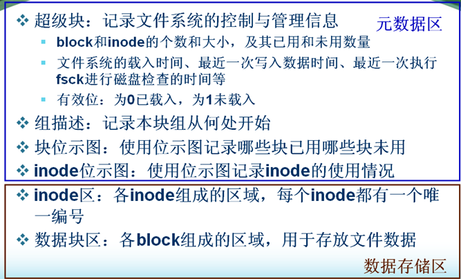

1. ### 分类及区别

- **reiserFS     suse /openSUSE            大量小文件的情况（200k以内）需要单独安装**
- **xfs     centos 7 默认            数据库服务器**
- **ext4/ext3/ext2     centos 6/5默认            普通服务流媒体视频存放文件**
- **swap         交换分区                 内存交换分区**

1. ### 文件系统选择

SAS/SATA硬盘文件系统选择：

reiserfs    大量小文件业务首选reiserfs（100K以内）, 单独安装。

xfs            有的门户的数据库MySQL业务会选择xfs。

ext4         视频下载，流媒体，数据库，小文件业务也OK，可以用默认的。

ext2         没有日志，蓝汛、网宿的cache业务，CDN网站加速服务的。

1. ## 磁盘必知必会故障排查

   1. ### 文件硬链接磁盘满故障

- 测试环境：

[root@oldboyedu tmp]#if=/dev/zero of=/tmp/500 bs=1M count=10000 #创建一个10G的文件

- 创建硬链接 :文件的另一个入口

[root@oldboyedu tmp]# ln 500 500.hard

[root@oldboyedu tmp]# ll 500 500.hard

-rw-r--r-- 2 root root 10485760000 Oct 27 12:03 500

-rw-r--r-- 2 root root 10485760000 Oct 27 12:03 500.hard

[root@oldboyedu tmp]# df -h|grep sda5

/dev/sda5 13G 12G 1.4G 90% /

- 删除文件，磁盘空间还是没有被释放

[root@oldboyedu tmp]# rm -fr test

[root@oldboyedu tmp]# df -h|grep sda5

/dev/sda5 13G 12G 1.4G 90% /

- 解决办法：删除源文件的硬链接文件，磁盘空间就被释放

[root@oldboyedu tmp]# df -h

Filesystem Size Used Avail Use% Mounted on

/dev/sda5 13G 1.9G 12G 15% /

- 删除一个文件的条件
  ：

文件的硬链接数为0                         rm：直接删除文件硬链接

没有其他进程使用这个文件                 lsof:（进程调用数为0） systemctl重启进程（服务）

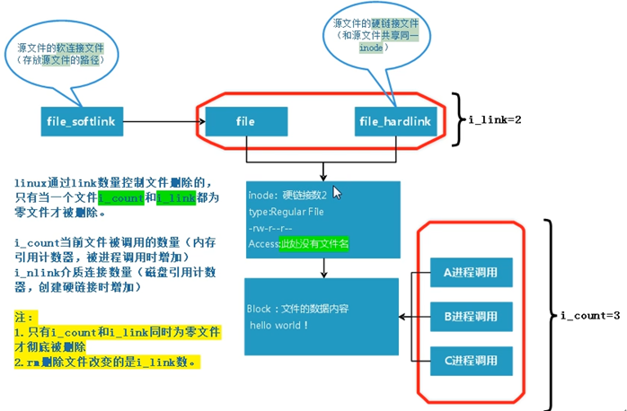

1. ### 磁盘的inode满故障

- 模拟环境：创建一个分区21MB的分区

[root@oldboyedu ~]# parted /dev/sdc mkpart primary 0 21 ignore

Warning: The resulting partition is not properly aligned for best performance.

Information: You may need to update /etc/fstab.

- 挂载到/mnt目录

[root@oldboyedu ~]# mount /dev/sdb1 /mnt/

- 批量创建文件

[root@oldboyedu mnt]# touch a{01..100000}

- 提示：文件满了

[root@oldboyedu mnt]# touch 1

touch: cannot touch '1': No space left on device

- df - h查看磁盘还有空间

[root@oldboyedu mnt]# df -h|grep sdb1

/dev/sdb1 17M 6.5M 11M 39% /mnt

- 解决办法：查看磁盘使用量：发现是文件的inode满

[root@oldboyedu mnt]# df -h|grep sdb1

/dev/sdb1 17M 6.5M 11M 39% /mnt

[root@oldboyedu mnt]# df -hi|grep sdb1

/dev/sdb1 11K 11K 0 100% /mnt

- 找出大目录（小文件多）

[root@oldboyedu mnt]# ll -hd /mnt/

drwxr-xr-x 2 root root 240K Oct 27 14:20 /mnt/

- 原因：有可能定时任务的记录没有定向到空，删除即可

[root@oldboyedu mnt]# rm -fr *

[root@oldboyedu mnt]# ll -hd /mnt/

drwxr-xr-x 2 root root 6 Oct 27 14:21 /mnt/

- inode释放了，空间就大了

[root@oldboyedu mnt]# df -i|grep sdb1

/dev/sdb1 10240 3 10237 1% /mnt

1. ### 磁盘的block满故障

- **模拟环境**

**[root@oldboyedu mnt]# seq 1000000000 >> /var/log/messages**

**[root@oldboyedu mnt]# df -h**

**Filesystem Size Used Avail Use% Mounted on**

**/dev/sda5 13G 12G 2.0G 86% /**

**devtmpfs 477M 0 477M 0% /dev**

**tmpfs 488M 0 488M 0% /dev/shm**

**tmpfs 488M 7.6M 480M 2% /run**

**tmpfs 488M 0 488M 0% /sys/fs/cgroup**

**/dev/sda2 4.9G 33M 4.9G 1% /home**

**/dev/sda1 197M 102M 96M 52% /boot**

**tmpfs 98M 0 98M 0% /run/user/0**

**/dev/sdb1 17M 1.1M 16M 7% /mnt**

- **du -sh /\* 解决办法：先查找大目录**

**[root@oldboyedu mnt]# du -sh /\***

**136K    /backup**

**92M    /boot**

**4.0K    /config.2017-11-11.tar.gz**

**30M    /etc**

**7.6M    /run**

**20K        /server**

**36K        /tmp**

**972M    /usr**

**11G        /var**

- **再依次查找**

**[root@oldboyedu mnt]# du -sh /var/\***

**0        /var/adm**

**523M    /var/cache**

**0        /var/crash**

**8.0K    /var/db**

**50M    /var/lib**

**0        /var/local**

**0        /var/lock**

**9.5G    /var/log**

**148K    /var/spool**

- **下一级继续查找**

**[root@oldboyedu mnt]# du -sh /var/log/\***

**2.1M    /var/log/anaconda**

**1.9M    /var/log/audit**

**4.0K    /var/log/grubby_prune_debug**

**24K    /var/log/lastlog**

**4.0K    /var/log/maillog**

**20K    /var/log/maillog-20181025**

**9.5G    /var/log/messages**

**156K    /var/log/messages-20181025**

**16K    /var/log/secure**

**4.0K    /var/log/secure-20181025**

- **找到文件确认之后再删除**

**[root@oldboyedu mnt]# ll -d /var/log/messages**

**-rw-r--r-- 1 root root 10136319491 Oct 27 14:35 /var/log/messages**

**[root@oldboyedu mnt]# rm -fr /var/log/messages #确认再删除**

1. ### 磁盘满进程占用故障

[root@oldboyedu mnt]# seq 1000000000 >> /var/log/messages

[root@oldboyedu mnt]# df -h

Filesystem Size Used Avail Use% Mounted on

/dev/sda5 13G 12G 2.0G 86% /

devtmpfs 477M 0 477M 0% /dev

tmpfs 488M 0 488M 0% /dev/shm

tmpfs 488M 7.6M 480M 2% /run

tmpfs 488M 0 488M 0% /sys/fs/cgroup

/dev/sda2 4.9G 33M 4.9G 1% /home

/dev/sda1 197M 102M 96M 52% /boot

tmpfs 98M 0 98M 0% /run/user/0

/dev/sdb1 17M 1.1M 16M 7% /mnt

- 找出文件位置（一级一级查找）

[root@oldboyedu mnt]# du -sh /* |egrep '[M;G]'

92M    /boot

30M    /etc

7.6M    /run

972M    /usr

11G    /var

[root@oldboyedu mnt]# du -sh /var/* |egrep '[M;G]'

523M    /var/cache

50M    /var/lib

9.5G    /var/log

[root@oldboyedu mnt]# du -sh /var/log/* |egrep '[M;G]'

2.1M    /var/log/anaconda

1.9M    /var/log/audit

9.5G    /var/log/messages

- 删除文件

[root@oldboyedu mnt]# ll -hd /var/log/messages

-rw-r--r-- 1 root root 9.5G Oct 27 14:35 /var/log/messages

[root@oldboyedu mnt]# rm -fr /var/log/messages

- 磁盘空间还是没变化

[root@oldboyedu mnt]# df -h

Filesystem Size Used Avail Use% Mounted on

/dev/sda5 13G 12G 2.0G 86% /

- losf 解决办法：
- losf ：显示系统中被打开的文件
- lsof 标记：给硬链接数为0 进程调用数不为0 文件
  加上一个标记 delete

[root@oldboyedu ~]# lsof|grep messages

rsyslogd 886 root 6w REG 8,5 10136319626 25166384/var/log/messages (deleted)

in:imjour 886 1143 root 6w REG 8,5 10136319626 25166384 /var/log/messages (deleted)

rs:main 886 1145 root 6w REG 8,5 10136319626 25166384 /var/log/messages (deleted)

- 886 ：父进程 886 1143 8861145 ：子进程
- 重启服务，空间就被释放

[root@oldboyedu ~]# systemctl restart rsyslog.service

[root@oldboyedu ~]# df -h

Filesystem Size Used Avail Use% Mounted on

/dev/sda5 13G 1.6G 12G 13% /

1. ## 磁盘相关命令总结

fdisk：    磁盘分区工具

-l 显示所有磁盘分区的信息

-c 关闭DOS兼容模式

-u 按照扇区为单位进行分区

parted：磁盘分区工具

partprobe：通知系统磁盘的分区信息变化 更新内核的硬盘分区表信息

tune2fs：调整和查看ext2/ext3文件系统的文件系统参数

-c 0 count 关闭每挂载多少次进行磁盘检查

-i 0 interval 关闭每个多久进行磁盘检查

关闭磁盘分区的自动检查

调整ext2/ext3/ext4文件系统参数

mkfs：

-t 指定文件系统类型

mkfs.ext4 == mkfs -t ext4

make filesystem 创建Linux文件系统

dumpe2fs：显示文件系统信息

resize2fs：调整ext2/ext3/ext4文件系统大小     lvm分区

fsck：filesystem check

-a 检查并修复Linux文件系统

dd：转换或复制文件

dd if=xxx of=xxx bs=x count=

if 输入文件

of输出文件

bs每次读取多少

count 读取次数

od：查看二进制文件的内容

-xa    以文字符号形式显示出来 .bin

mount：挂载文件系统

-t 指定文件系统

umount：卸载文件系统

-lf     强制卸载

df：报告文件系统磁盘空间的使用情况

-h 以人类可读的形式显示磁盘大小

-i 显示inode 号码

mkswap：创建交换分区

swapon：激活交换分区

-s 系统swap的组成

swapoff：关闭交换分区

sync：刷新文件系统缓冲区

top：实时显示系统运行信息

**1.1 系统运行时间和平均负载：**

top命令的顶部显示与uptime命令相似的输出

这些字段显示：

当前时间

系统已运行的时间

当前登录用户的数量

相应最近5、10和15分钟内的平均负载。

可以使用'l'命令切换uptime的显示。

21:45:11 — 当前系统时间
0 days, 4:54 — 系统已经运行了4小时54分钟（在这期间没有重启过）
2 users — 当前有2个用户登录系统
load average:0.24, 0.15, 0.19 — load average后面的三个数分别是5分钟、10分钟、15分钟的负载情况。

load average数据是每隔5秒钟检查一次活跃的进程数，然后按特定算法计算出的数值。如果这个数除以逻辑CPU的数量，结果高于5的时候就表明系统在超负荷运转了。

**1.2 任务:**

Tasks — 任务（进程），系统现在共有144个进程，其中处于运行中的有1个，143个在休眠（sleep），stoped状态的有0个，zombie状态（僵尸）的有0个。
第二行显示的是任务或者进程的总结。进程可以处于不同的状态。这里显示了全部进程的数量。除此之外，还有正在运行、睡眠、停止、僵尸进程的数量（僵尸是一种进程的状态）。这些进程概括信息可以用't'切换显示

**1.3 CPU 状态:**

这里显示不同模式下所占cpu时间百分比，这些不同的cpu时间表示：
us, user： 运行(未调整优先级的) 用户进程的CPU时间
sy，system: 运行内核进程的CPU时间
ni，niced：运行已调整优先级的用户进程的CPU时间
wa，IO wait: 用于等待IO完成的CPU时间
hi：处理硬件中断的CPU时间
si: 处理软件中断的CPU时间
st：这个虚拟机被hypervisor偷去的CPU时间（译注：如果当前处于一个hypervisor下的vm，实际上hypervisor也是要消耗一部分CPU处理时间的）。
可以使用't'命令切换显示。
1.3% us — 用户空间占用CPU的百分比。
1.0% sy — 内核空间占用CPU的百分比。
0.0% ni — 改变过优先级的进程占用CPU的百分比
97.3% id — 空闲CPU百分比
0.0% wa — IO等待占用CPU的百分比
0.3% hi — 硬中断（Hardware IRQ）占用CPU的百分比
0.0% si — 软中断（Software Interrupts）占用CPU的百分比
在这里CPU的使用比率和windows概念不同，如果你不理解用户空间和内核空间，需要充充电了。

**1.4 内存使用:**

接下来两行显示内存使用率，有点像'free'命令。第一行是物理内存使用，第二行是虚拟内存使用(交换空间)。
物理内存显示如下:全部可用内存、已使用内存、空闲内存、缓冲内存。相似地：交换部分显示的是：全部、已使用、空闲和缓冲交换空间。
内存显示可以用'm'命令切换。
509248k total — 物理内存总量（509M）
495964k used — 使用中的内存总量（495M）
13284k free — 空闲内存总量（13M）
25364k buffers — 缓存的内存量 （25M）

swap交换分区
492536k total — 交换区总量（492M）
11856k used — 使用的交换区总量（11M）
480680k free — 空闲交换区总量（480M）
202224k cached — 缓冲的交换区总量（202M）

这里要说明的是不能用windows的内存概念理解这些数据，如果按windows的方式此台服务器"危矣"：8G的内存总量只剩下530M的可用内存。Linux的内存管理有其特殊性，复杂点需要一本书来说明，这里只是简单说点和我们传统概念（windows）的不同。
第四行中使用中的内存总量（used）指的是现在系统内核控制的内存数，空闲内存总量（free）是内核还未纳入其管控范围的数量。纳入内核管理的内存不见得都在使用中，还包括过去使用过的现在可以被重复利用的内存，内核并不把这些可被重新使用的内存交还到free中去，因此在linux上free内存会越来越少，但不用为此担心。
如果出于习惯去计算可用内存数，这里有个近似的计算公式：第四行的free + 第四行的buffers + 第五行的cached，按这个公式此台服务器的可用内存：
13284+25364+202224 = 240M。
对于内存监控，在top里我们要时刻监控第五行swap交换分区的used，如果这个数值在不断的变化，说明内核在不断进行内存和swap的数据交换，这是真正的内存不够用了。
第六行是空行

**1.5 各进程（任务）的状态监控:**

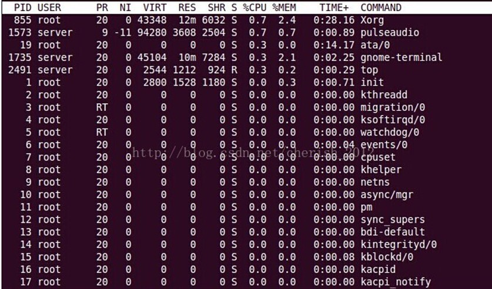
PID：进程ID，进程的唯一标识符
USER：进程所有者的实际用户名。
PR：进程的调度优先级。这个字段的一些值是'rt'。这意味这这些进程运行在实时态。
NI：进程的nice值（优先级）。越小的值意味着越高的优先级。负值表示高优先级，正值表示低优先级
VIRT：进程使用的虚拟内存。进程使用的虚拟内存总量，单位kb。VIRT=SWAP+RES
RES：驻留内存大小。驻留内存是任务使用的非交换物理内存大小。进程使用的、未被换出的物理内存大小，单位kb。RES=CODE+DATA
SHR：SHR是进程使用的共享内存。共享内存大小，单位kb
S：这个是进程的状态。它有以下不同的值:
D - 不可中断的睡眠态。
R – 运行态
S – 睡眠态
T – 被跟踪或已停止
Z – 僵尸态
%CPU：自从上一次更新时到现在任务所使用的CPU时间百分比。
%MEM：进程使用的可用物理内存百分比。
TIME+：任务启动后到现在所使用的全部CPU时间，精确到百分之一秒。
COMMAND：运行进程所使用的命令。进程名称（命令名/命令行）
iotop：        查看系统的磁盘读写速度 显示出进程使用swap的情况io input/output 输入/输出 读写
htop：        top升级版glances:     全面的系统性能监控工具iostat:         监控系统设备的IO负载情iftop：        查询网卡流量使用情况ifstat: 查看网络流量-i 指定监视网卡
-n 不要把ip地址解析为域名
megacli：显示raid状态或设置raidipmitool：显示服务器硬件信息CPU风扇转速 温度lscpu: 显示cpu的信息本章知识点总结**raid级别，特点及应用场景****主分区、逻辑分区、扩展分区特点及关系****通过fdisk parted进行分区****使用/dev/sdb创建一个分区(使用所有容量），把他挂载到/mnt上面****故障案例：企业案例：java环境内存不够用，大量占用swap****/etc/fstab 每一列的含义****文件系统的分类****磁盘故障排查****与磁盘相关的命令**