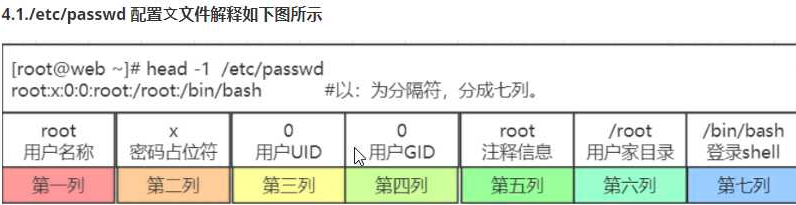

### Linux用户管理

```
ll /etc/passwd
ll /etc/shadow

cat /etc/passwd
root:x:0:0:root:/root:/bin/bash
root 		用户名
x			密码占位符
0			用户id
0			用户id/GID
root		用户注释信息
/root		家目录
/bin/bash	用户登录的shell

cat /etc/shadow
root:$6$IAJY3Sf4cunx47uc$HhNxkC0iQSjIPS/A6ABKmODAhK8CS27nCnlp5k7H6..AMcKGdZAXsV.vjC0r2ja5uq5cTZN1PsVRn5bLo1Ebk.::0:99999:7:::
```



**/etc/shadow**


```
查看用户的id信息
id
uid=0(root) gid=0(root) groups=0(root) context=unconfined_u:unconfined_r:unconfined_t:s0-s0:c0.c1023
```

```
用户相关命令
useradd	创建用户
	-u 		设置uid
	-g		指定GID，前提组要存在
	-c		设置注释信息
	-s		指定登录shell
	-M		不创建家目录
	-r		创建系统用户，不创建家目录(与-M用一个就行)
	-d		指定家目录
用户创建过程有2个相关文件
过滤空行和注释行，进行查看：
grep -Ev '^$|^#' /etc/login.defs
cat /etc/default/useradd

用户家目录不存在故障解决方法
cp /etc/skel/.bash* ./

usermod 修改用户信息
	usermod -u 666 user01	修改uid号和家目录
	usermod -d				更换组
	usermod -c				修改注释信息
	usermod -s				修改登录shell
	usermod -l new old		修改用户名	
	
userdel
	usermod user01			默认删除用户，不删除家目录和邮件信息，彻底删除(-r)
	usermod -r				删除家目录和邮件信息

CentOS7中，uid号约定
	0		超级管理员
	1-200	系统用户，进程服务运行的用户
	201-999	系统用户，服务软件运行用户
	1000+	普通用户
```

### Linux密码管理

```
passwd 				设置密码
passwd				针对当前用户设置密码
passwd username		针对用户设置密码

root用户可以给任意用户设置密码，密码没有要求
普通用户只能针对自己设置密码，密码必须最低8位，且结构不能太简单

非交互式设置密码：
echo '1' |passwd --stdin root
设置随机密码并将密码打印到终端且保存在一个文件中
echo  $(echo  $RANDOM|md5sum |cut -c  1-10)|tee  pass.txt   |passwd   --stdin root
使用设置密码工具生成随机密码
yum  install -y expect
生成24位密码
mkpasswd   -l  24  -d 6  -c 6 -C 6 -s 6
```

### Linux用户组

```
基本组 一个用户只能有一个基本组
附加组 用户有多个附加组
组相关命令
groupadd
	-g				指定GID号
	groupadd test-1
	groupadd test-2
	useradd -u 888 -g test-1 -G test-2 user-1
	id user-1
	groupadd test-3
	usermod -aG test-3 user-1
	id user-1
	groupadd test-4
	usermod -G test-4 user-1
	id user-1
groupmod
	-g				修改GID
	-n				修改组名称
groupdel
	用户组不属于任何用户的基本组，可以删除，否则，不能删除
	解决删除用户组属于用户的基本组
		1.修改该用户的基本组
		2.删除用户组下面的用户

cat /etc/group
root:x:0:
root 		用户组名称
x			密码占位符
0			GID
第4列 		显示该用户属于哪个用户附加组，就显示这个用户名称

cat /etc/gshadow
root:::
```

### 查看用户的信息

```
id 			查看用户信息
echo $USER	
echo $UID
w			查看系统所有登录的用户
who			查看系统登录用户
whoami		查看当前登录用户
```

### 用户授权

```
su user01			切换用户，不加载user01的环境变量
su - user01			加'-'，加载user01的环境变量
root => 普通用户 	不需要密码
普通用户=> root		需要密码
如果是从root切换到普通用户的，要回到root用户，可以使用ctrl + d 不需要密码切回root

sudu


环境变量
个人
	.bash_profile
	.bashrc
全局
	/etc/profile			系统环境变量，别名
	/etc/profile.d/*		
	/etc/bashrc				本地变量和别名

交互式shell
非交互式shell
登录式shell
非登录式shell
```

```
授权
sudu
visudu

root		ALL=(ALL)		ALL
user01		ALL=(ALL)		/bin/cat,/bin/yum
用户名		  主机名=(角色)		权限

设置不需要使用密码
user01		ALL=(ALL)		NOPASSWD:/bin/cat,/bin/yum
```

### 权限

```bash
-rw-r--r--
属主 属组 其他用户

r			4 可读
w			2 可写
x			1 可执行
-			0 没有任何权限

设置属主权限
chmod u+x test.txt
chmod u-x test.txt
chmod u=rwx test.txt
设置属组权限
chmod g+x a.txt
chmod g-x a.txt
chmod g=rx a.txt
设置其他用户权限
chmod o+x a.txt
chmod o-x a.txt
chmod o=rx a.txt
针对多个分别进行设置
chmod u=rw,g=r,o=r test.txt
针对三个同时设置
chmod a+x a.txt

通过数字设置权限
chmod 644 a.txt

递归赋予权限
chmod -R 744 test	递归修改test目录及其下的所有文件的权限为744，但是当test下又创建新的文件后，创建的新文件权限为文件创建默认权限，和刚才修改的744不同步
```

#### 权限对文件的影响

```
只有r权限			只能查看文件，其他的不能操作
只有w权限			不能使用vi命令进行修改，如果强制修改会覆盖原内容，只能追加
w权限需要与r权限进行配合，不要给文件单独w权限，通常是rw
只有x权限			什么都干不了，需要r权限配合，rx

正常设置权限
r rwr xr wx
```

#### 权限对目录的影响

```bash
目录r权限				是否能够查看目录下的列表，如果只有r权限，无法查看目录下的文件属性信息，只能？？表示
目录w权限				是否能够对目录下的文件进行删除，移动等操作
目录x权限				是否能够进入该目录

目录r权限需要目录x权限配合
目录w权限需要目录x权限配合，可以删除，新建文件的权限，如果要移动，需要目标目录有rw权限
目录x权限只能进入目录，其他的操作都不能执行
```

#### 属主属组的修改

```
chown jsson test.txt		只修改属主，子文件不修改
chown jsson. test.txt		同时修改属主和属组，子文件不修改
chown .root test.txt		只修改属组，子文件不修改
	选项 -R						递归修改，子文件也会被全部修改
chgrp jason test.txt		只能修改属组

超级管理员root用户创建的文件属主和属组就是root
普通用户user用户创建的文件属主和属组就是user
```

#### 权限控制位

```
查看命令 stat test.log
查看权限位 umask
umask 033	临时修改控制权限位，默认值022，永久修改需要修改配置文件/etc/profile
	计算目录权限位方法
		umask的默认权限位是022,目录的最大权限是777，则系统默认创建的目录权限位777-022=755
		即 目录权限 = 目录最大权限 - 默认权限
	计算文件权限位方法
		umask的默认权限位是022,文件的最大权限是666，则系统默认创建的目录权限位666-022=644，如果文件的权限位遇到奇数时候，奇数位+1
		即 文件权限 = 文件最大权限 - 默认权限		
```

#### 特殊权限

```
setuid			执行命令的时候相当于该命令的所有者(属主)
权限位是4位，第一位如果是4，则标识该文件有setuid权限
大S和小s区别：	主要看文件的属主的x权限，如果有x权限，就是大s，没有就是大S

setgid			共享目录，让所有用户在一个目录下创建的所有文件属主都是固定一个组 
	使用	
			groupadd	setgid_test
			chown -R .setgid_test /opt/
			chmod g+s /opt/
			ll -d /opt/
sticky		让所有用户在一个目录=只能管理的文件
权限位是4位，第一位如果是2，则标识该文件有sticky权限
chmod o+t /tmp/sgt
```

特殊属性(隐藏属性)

```
a			只能对文件进行追加的操作，其他权限模样，可读，可cp
i			只能查看和cp，其他操作不允许
隐藏属性查看方法
lsattr test.txt
--------------- test.txt	代表无特殊属性
添加隐藏属性方法
chattr +a test.txt
------a-------- test.txt	代表有特殊属性了
```

#### 输入输出

详情见[Linux系统管理-输入输出](https://www.increase93.com/base-10.html)

##### 重定向

```
三个文件/dev/std*
标准输入stdin
标准输出stdout
错误输出stderr
```

##### 输出重定向

```
ls sgt 2>a.log		当sgt不存在时候，后面的2代表将错误信息写入a.log文件中，>改成>>追加
ls /tmp;sgt 2&>>a.log	;代表多命令输入，混合输入，同时将正确和错误的信息追加到a.log
```

##### 输入重定向

```
将原本要输出到屏幕的数据信息，重新定向到某个指定的文件中。比如：每天凌晨定时备份数据，希望将备份数据的结果保存到某个文件中。这样第二天通过查看文件的内容就知道昨天备份的数据是成功还是失败。
```

```
tr命令使用
```

##### 管道

```
管道操作符号 "|" ，主要用来连接左右两个命令, 将左侧的命令的标准输出, 交给右侧命令的标准输入 
PS: 无法传递标准错误输出至后者命令
```

##### tee技术

```

```

##### 查找 find

```
命令	路径	选项	表达式	动作

根据文件名称查找
find /etc -name 'ifcfg-eth0' -print		-name 根据名称查找
find /etc -name 'ifcfg-eth*' -print		-name 根据名称查找， *代表模糊查找
find /data -iname 'test.log'			-iname 根据名称查找，忽略大小写

根据文件类型查找
find /opt -type d -ls					-type 根据文件类型查找
find /etc -type l -ls					-type 根据文件类型查找
	文件类型
		f 普通文件
		d 目录
		l 软链接
		b 块设备
		c 字符设备
		p 管道文件
		s socket文件
		
根据文件大小查找		
find /var/log -size -50k |xargs ls -lh		50k 等于50k(管道符不支持别名，需要ls -lh =>ll)
find /var/log -size -50k |xargs ls -lh				-50k 小于50k
find /var/log -type f -size +50k |xargs ls -lh		+50k 大于50k
find /var/log -size +100k -size -200k |xargs ls -lh	大于100k小于200k
find /var/log -size +100k -a -size -200k |xargs ls -lh	大于100k小于200k(-a代表并且，写一起也是一个意思)
find /var/log -type f -size -1k -o -size +1M |xargs ls -lh  -o代表或者，小于1k或大于1M
	-size		根据文件大小
    	b		字节
    	k		kb
    	M、G	   使用大写
    -a			与关系
    -o			或关系

根据属主和属组查找文件
find /opt/ -user jason -ls			-user 根据属主为jason查找文件
find /opt/ -user jason -group jason -ls		根据属主为jason且属组为jason查找文件
find /opt/ \( -user jason -o -group jason \) -ls  根据属主为jason或属组为jason
find /opt/ -nouser -ls				没有属主
find /opt/ -nogroup -ls				没有属组

根据目录的阶级 深度查找
-maxdepth

根据权限查找
find /opt/ -perm -444 -ls		包含读权限，全局，每一项都包含
find /opt/ -perm 644 -ls		精确查找
find /opt/ -perm /444 -ls		包含，只要有一项满足就行
find / -perm -1000 -ls 			根据特殊权限
find / -perm -2000 -ls 			根据特殊权限
find / -perm -4000 -ls 			根据特殊权限

根据修改时间查找
find /opt/ -mtime -7 -ls		7天以内
find /opt/ -mtime +7 -ls		7天以前
find /opt/ -mtime 7 -ls			第7天
find /opt/ -mtime +7 |xargs rm -f	把7天前的数据删除
```

find**默认动作**

```
-print		打印，默认动作
-ls			以长格式形式显示文件信息，详细信息的属性信息
-delete		把查找出来的数据删除，只能删除文件或空目录，无法递归删除
-ok			后面跟shell命令，会询问是否确定操作
	find /opt/ -mtime -7 -ok rm -f {} \;
-exec		后面跟shell命令，但不需要提示，直接操作
	find /opt/ -mtime -7 -exec rm -f {} \;	
```

##### find 组合使用

```
mkdir /opt/{01..05}
将查找的内容复制到指定目录下的5种方法
find /var/log/ -type f -size +200k -exec cp -v {} /opt/01/ \;

find /var/log/ -type f -size +200k | xargs cp -t /opt/02

find /var/log/ -type f -size +200k | xargs -I {} cp {} /opt/03

cp `find /var/log/ -type f -size +200k` /opt/04

cp $(find /var/log/ -type f -size +200k) /opt/05
```

