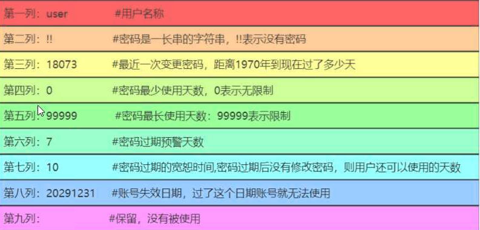

### Linux用户管理

```
ll /etc/passwd
ll /etc/shadow

cat /etc/passwd
root:x:0:0:root:/root:/bin/bash
root 		用户名
x			密码占位符
0			用户id
0			用户id/GID
root		用户注释信息
/root		家目录
/bin/bash	用户登录的shell

cat /etc/shadow
root:$6$IAJY3Sf4cunx47uc$HhNxkC0iQSjIPS/A6ABKmODAhK8CS27nCnlp5k7H6..AMcKGdZAXsV.vjC0r2ja5uq5cTZN1PsVRn5bLo1Ebk.::0:99999:7:::
```


**/etc/shadow**



```
查看用户的id信息
id
uid=0(root) gid=0(root) groups=0(root) context=unconfined_u:unconfined_r:unconfined_t:s0-s0:c0.c1023
```

```
用户相关命令
useradd	创建用户
	-u 		设置uid
	-g		指定GID，前提组要存在
	-c		设置注释信息
	-s		指定登录shell
	-M		不创建家目录
	-r		创建系统用户，不创建家目录(与-M用一个就行)
	-d		指定家目录
用户创建过程有2个相关文件
过滤空行和注释行，进行查看：
grep -Ev '^$|^#' /etc/login.defs
cat /etc/default/useradd

用户家目录不存在故障解决方法
cp /etc/skel/.bash* ./

usermod 修改用户信息
	usermod -u 666 user01	修改uid号和家目录
	usermod -d				更换组
	usermod -c				修改注释信息
	usermod -s				修改登录shell
	usermod -l new old		修改用户名	
	
userdel
	usermod user01			默认删除用户，不删除家目录和邮件信息，彻底删除(-r)
	usermod -r				删除家目录和邮件信息

CentOS7中，uid号约定
	0		超级管理员
	1-200	系统用户，进程服务运行的用户
	201-999	系统用户，服务软件运行用户
	1000+	普通用户
```

### Linux密码管理

```
passwd 				设置密码
passwd				针对当前用户设置密码
passwd username		针对用户设置密码

root用户可以给任意用户设置密码，密码没有要求
普通用户只能针对自己设置密码，密码必须最低8位，且结构不能太简单

非交互式设置密码：
echo '1' |passwd --stdin root
设置随机密码并将密码打印到终端且保存在一个文件中
echo  $(echo  $RANDOM|md5sum |cut -c  1-10)|tee  pass.txt   |passwd   --stdin root
使用设置密码工具生成随机密码
yum  install -y expect
生成24位密码
mkpasswd   -l  24  -d 6  -c 6 -C 6 -s 6
```

### Linux用户组

```
基本组 一个用户只能有一个基本组
附加组 用户有多个附加组
组相关命令
groupadd
	-g				指定GID号
	groupadd test-1
	groupadd test-2
	useradd -u 888 -g test-1 -G test-2 user-1
	id user-1
	groupadd test-3
	usermod -aG test-3 user-1
	id user-1
	groupadd test-4
	usermod -G test-4 user-1
	id user-1
groupmod
	-g				修改GID
	-n				修改组名称
groupdel
	用户组不属于任何用户的基本组，可以删除，否则，不能删除
	解决删除用户组属于用户的基本组
		1.修改该用户的基本组
		2.删除用户组下面的用户

cat /etc/group
root:x:0:
root 		用户组名称
x			密码占位符
0			GID
第4列 		显示该用户属于哪个用户附加组，就显示这个用户名称

cat /etc/gshadow
root:::
```

### 查看用户的信息

```
id 			查看用户信息
echo $USER	
echo $UID
w			查看系统所有登录的用户
who			查看系统登录用户
whoami		查看当前登录用户
```

### 用户授权

```
su user01			切换用户，不加载user01的环境变量
su - user01			加'-'，加载user01的环境变量
root => 普通用户 	不需要密码
普通用户=> root		需要密码
如果是从root切换到普通用户的，要回到root用户，可以使用ctrl + d 不需要密码切回root

sudu


环境变量
个人
	.bash_profile
	.bashrc
全局
	/etc/profile			系统环境变量，别名
	/etc/profile.d/*		
	/etc/bashrc				本地变量和别名

交互式shell
非交互式shell
登录式shell
非登录式shell
```

```
授权
sudu
visudu

root		ALL=(ALL)		ALL
user01		ALL=(ALL)		/bin/cat,/bin/yum
用户名		  主机名=(角色)		权限

设置不需要使用密码
user01		ALL=(ALL)		NOPASSWD:/bin/cat,/bin/yum
```

