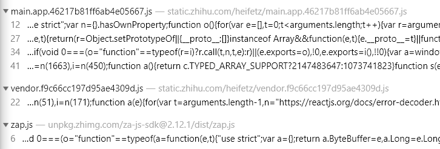
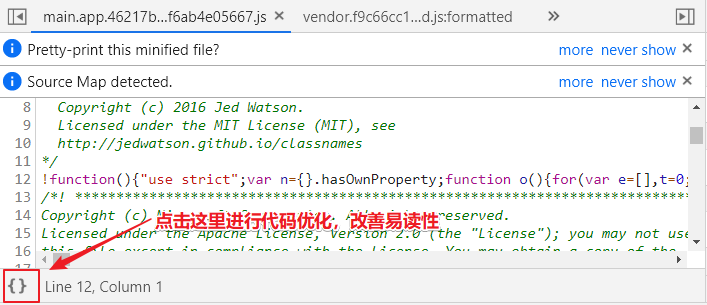
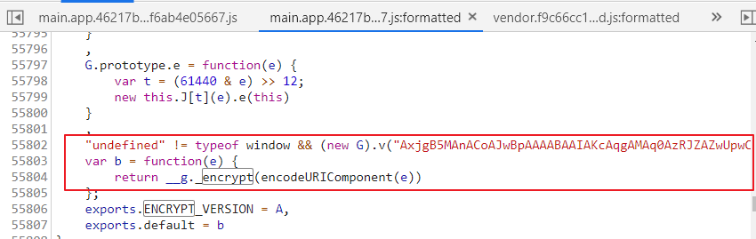
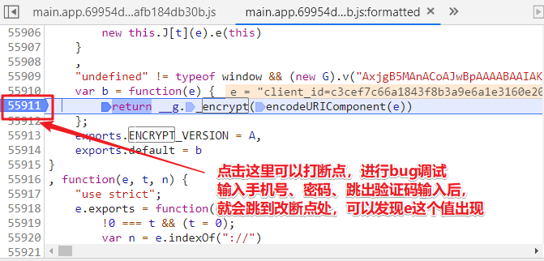
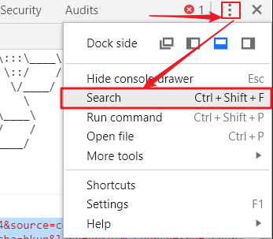
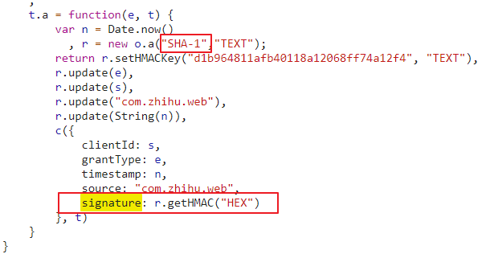
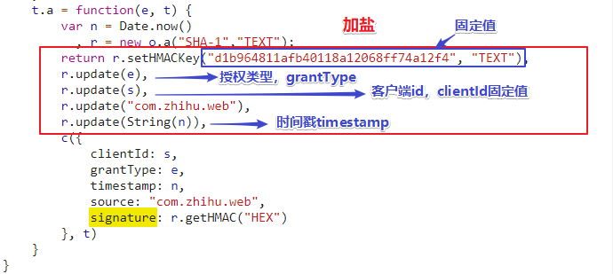

## 知乎网站信息爬取

### 打开https://www.zhihu.com/发生了什么

```
跳转到登录页面 https://www.zhihu.com/signin?next=%2F
同时：给浏览器返回cookie数据
```

### 模拟登陆

**点击密码登录的时候，浏览器会发送get请求和put请求，获取验证码相关数据**

#### 1、登录验证码分析

##### 1.1 第一次请求，get请求，看看要不要输入验证码

登录>密码登录>情况有多种，用户名和密码后会出现倒立的文字图片、验证码

中文文字验证和数字字母验证码的出现时根据发送请求拼接的字符串不一样导致的：

```
字母数字验证码get请求 https://www.zhihu.com/api/v3/oauth/captcha?lang=en
中文汉字验证码get请求 https://www.zhihu.com/api/v3/oauth/captcha?lang=cn
```

```
相应结果 {"show_captcha":false}
为True时候才会出现验证码
```

##### 1.2 第二次请求，put请求，获取验证码图片

如果验证码相应结果为True，就会再想改url发送一次put请求，获取验证码base64格式图片

```
put请求 https://www.zhihu.com/api/v3/oauth/captcha?lang=en
```

```
响应图片数据 {"img_base64":"*******"}
```

##### 1.3 第三次请求，post请求，发送验证码，进行验证是否正确

```
post请求 https://www.zhihu.com/api/v3/oauth/captcha?lang=en
验证码正确响应 {"success":true}
验证码错误响应 {"error":{"message":"请提交正确的验证码 :(","code":120000,"name":"ERR_VERITY_CAPTCHA"}}
```

#### 2、登录请求分析

##### 2.1 登录请求初步分析

```
post请求 https://www.zhihu.com/api/v3/oauth/sign_in
```

**经过分析，发现携带的参数Form Data经过加密处理**

```
类似这样：
aR79k4U0cT2tXqYq8LPG6vHmxq2pkLnmtbSBDgg9kLtxgeSmhbfGiqX1jbfVoG398LF0gQN0cT2tuqYq8LkMQbwGivwOgUxGw9e0g4e8kCV92vgBzh3qk4R92LkYFhVGwqoVJbCGST2tECx9BLkBEJXmST2tWbN1q9e0gAX1F93OUqNq8Lf02Ar0r02x2TY0EqYhHUcmoqVOUu3q8LPySTrqS8FX2820m8tyPU9qkLnm2LfBpwNmkveMcBtxgTYyG8t0e09qHqYpFu2qhgFBnU90c0FXgCFq1_FqUgrqHqSpngtqM8x924_BkC3VUbSBtq3qk478gGpucUO1PD3ZJCe8Xq2tgqNMsvSMS79h2MYxoLt0KMYqcQ9qr_LxgRVmZ9oMgGL1eBtxg_NMwGoM2JXMXq2tguVKKvwGEJHM3BtxgRF0zuFqrH9BrXxpggY8BTxyNguq6X2fS828G8OBFgr8Xq2tHgSVKbOBDBe8
```

##### 2.2 分析并找出加密算法

这里需要知道一个惯性思维，就是后端程序员在码代码的时候为了代码的易读性肯定会用一些常见的英文字母作为加密算法函数的命名，这里我们猜测加密算法的命名应该是encrypt这个单词，所以点击检查框右上角三个竖点，然后点“Search”,进入全局搜索，这样就可以搜索网页所以加载的文件内容了


输入关键字：encrypt，搜到三个js文件中有encrypt



经过一个一个查找，发现在main.app.js中找到我们需要的加密算法函数

**技巧：**



然后在这里面Crtl + F 再进行进一步搜索encrypt，找到加密函数





**在console输入e回车，查看e的值**

```
"client_id=c3cef7c66a1843f8b3a9e6a1e3160e20&grant_type=password&timestamp=1565593945974&source=com.zhihu.web&signature=12b0bb55dd30a7c9ed528d5a897f192dbdec8770&username=%2B8613638667868&password=qwer12345&captcha=hkup&lang=en&utm_source=&ref_source=other_https%3A%2F%2Fwww.zhihu.com%2Fsignin%3Fnext%3D%252F"
```

**可以看出，e值是由好几段数据，用&符号拼接而成**

```
客户端id固定不变 client_id=c3cef7c66a1843f8b3a9e6a1e3160e20
授权类型 grant_type=password
时间戳 timestamp=1565593945974
源网站 source=com.zhihu.web
签名(动态生成，已加密) signature=12b0bb55dd30a7c9ed528d5a897f192dbdec8770
用户名(手机号+86) username=%2B8613638667868
密码 password=qwer12345
验证码信息 captcha=hkup
验证码形式 lang=en
空字段 utm_source=
固定字段 ref_source=other_https%3A%2F%2Fwww.zhihu.com%2Fsignin%3Fnext%3D%252F
```

> ```
> 需要注意一点：e里面有些字段进行了url编码，比如手机号签名的+86的+号是%2B,还有如果验证码形式是点中文汉字那就是个坐标数据，一会有url编码数据，下面固定字段ref_source中也有url编码
> python中对url编码解码的方法：
> 导入 urllib.parse
> 编码 urllib.parse.quote()
> 解码 urllib.parse.unquote()
> 示例：
> en_url = urllib.parse.quote("hello 世界!"))
> print(en_url)
> hello%20%E4%B8%96%E7%95%8C%21
> de_url = urllib.parse.unquote(en_url)
> print(de_url)
> hello 世界!
> ```

既然字段中有动态生成的签名数据，所以要先找到签名的加密方法才行

继续用Search进行全页面搜索关键字 signature



发现它在main.app.js文件中，点击｛｝优化js代码，Ctrl + F搜索 signature，找到相应信息



可以看出，签名数据是通过HMAC+SHA-1算法生成，接着再进行分析




(urllibe3.parse  urlencode(dict) 将字典转成k1=v1&k2=v2.....,会把中文转成utf-8编码)

先分析e是啥，e里面有个签名算法

然后分析encodeURIComponent(e)方法

python执行js代码

watch，debug模式

在线打码平台

